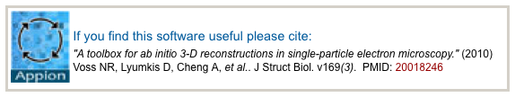

## **[Terminology](/appion/Appion_Manual/Appion_User_Guide/Appion_Processing/Terminology)**

## **[Common Workflow](/appion/Appion_Manual/Appion_User_Guide/Appion_Processing/Common_Workflow)**

* [Step by Step Guide](/appion/Appion_Manual/Appion_User_Guide/Appion_Processing/Common_Workflow/Step_by_Step_Guide)

* [Quality Assessment](/appion/Appion_Manual/Appion_User_Guide/Appion_Processing/Common_Workflow/Quality_Assessment)

* [Random-Conical Tilt (RCT) Reconstruction workflow](/appion/Appion_Manual/Appion_User_Guide/Appion_Processing/Common_Workflow/Random-Conical_Tilt_RCT_Reconstruction_workflow)

* [Trimer Processing workflow](/appion/Appion_Manual/Appion_User_Guide/Appion_Processing/Common_Workflow/Trimer_processing_workflow)

## **[Processing Cluster Login](/appion/Appion_Manual/Appion_User_Guide/Appion_Processing/Processing_Cluster_Login)**

## **[Direct Detector Frame Processing](/appion/Appion_Manual/Appion_User_Guide/Appion_Processing/Direct_Detector_Frame_Processing)**

* [Gain/Dark correction of the raw frame with or without drift correction](/appion/Appion_Manual/Appion_User_Guide/Appion_Processing/Direct_Detector_Frame_Processing/GainDark_correction_of_the_raw_frame_with_or_without_drift_correction)

* [Catch up DD frame alignment](/appion/Appion_Manual/Appion_User_Guide/Appion_Processing/Direct_Detector_Frame_Processing/Catch_up_DD_frame_alignment) on gpu-capable processing host

## **[CTF Estimation](/appion/Appion_Manual/Appion_User_Guide/Appion_Processing/CTF_Estimation)**

* [Ace Estimation](/appion/Appion_Manual/Appion_User_Guide/Appion_Processing/CTF_Estimation/Ace_Estimation)

* [Ace 2 Estimation](/appion/Appion_Manual/Appion_User_Guide/Appion_Processing/CTF_Estimation/Ace_2_Estimation)

* [CtfFind Estimation](/appion/Appion_Manual/Appion_User_Guide/Appion_Processing/CTF_Estimation/CtfFind_Estimation)

* [Recommendations for phase plate CTF estimation](/appion/Appion_Manual/Appion_User_Guide/Appion_Processing/CTF_Estimation/Phase_plate_CTF_Estimation)

* [Repeat from other session](/appion/Appion_Manual/Appion_User_Guide/Appion_Processing/Repeat_from_other_session)

## **[Particle Selection](/appion/Appion_Manual/Appion_User_Guide/Appion_Processing/Particle_Selection)**

* [Template Picking](/appion/Appion_Manual/Appion_User_Guide/Appion_Processing/Particle_Selection/Template_Picking)

* [Dog Picking](/appion/Appion_Manual/Appion_User_Guide/Appion_Processing/Particle_Selection/Dog_Picking)

* [Manual Picking](/appion/Appion_Manual/Appion_User_Guide/Appion_Processing/Particle_Selection/Manual_Picking)

* [Repeat from other session](/appion/Appion_Manual/Appion_User_Guide/Appion_Processing/Repeat_from_other_session)

* [Random Conical Tilt Picking](/appion/Appion_Manual/Appion_User_Guide/Appion_Processing/Particle_Selection/Random_Conical_Tilt_Picking)

[Align and Edit Tilt Pairs](/appion/Appion_Manual/Appion_User_Guide/Appion_Processing/Particle_Selection/Random_Conical_Tilt_Picking/Align_and_Edit_Tilt_Pairs)

[Auto Align Tilt Pairs](/appion/Appion_Manual/Appion_User_Guide/Appion_Processing/Particle_Selection/Random_Conical_Tilt_Picking/Auto_Align_Tilt_Pairs)

## **[Stacks](/appion/Appion_Manual/Appion_User_Guide/Appion_Processing/Stacks)**

* [Stack creation](/appion/Appion_Manual/Appion_User_Guide/Appion_Processing/Stacks/Stack_Creation)

* [more stack tools](/appion/Appion_Manual/Appion_User_Guide/Appion_Processing/Stacks/More_Stack_Tools)

[Combine Stacks](/appion/Appion_Manual/Appion_User_Guide/Appion_Processing/Stacks/More_Stack_Tools/Combine_Stacks)

[View Stacks](/appion/Appion_Manual/Appion_User_Guide/Appion_Processing/Stacks/More_Stack_Tools/View_Stacks)

* [Filter by MeanSTDev](/appion/Appion_Manual/Appion_User_Guide/Appion_Processing/Stacks/More_Stack_Tools/View_Stacks/Filter_by_MeanStdev)

* [Center Particles](/appion/Appion_Manual/Appion_User_Guide/Appion_Processing/Stacks/More_Stack_Tools/View_Stacks/Center_Particles)

* [Sort Junk](/appion/Appion_Manual/Appion_User_Guide/Appion_Processing/Stacks/More_Stack_Tools/View_Stacks/Sort_Junk)

* [Create Substack](/appion/Appion_Manual/Appion_User_Guide/Appion_Processing/Stacks/More_Stack_Tools/View_Stacks/Create_Substack)

[Alignment SubStacks](/appion/Alignment_SubStacks)

[Jumpers SubStack](/appion/Appion_Manual/Appion_User_Guide/Appion_Processing/Stacks/More_Stack_Tools/Jumpers_SubStack)

[Convert Stack into Particle Picks](/appion/Appion_Manual/Appion_User_Guide/Appion_Processing/Stacks/More_Stack_Tools/Convert_Stack_into_Particle_Picks)

[Run DE Particle Frame Alignment](/appion/Run_DE_Particle_Frame_Alignment)

## **[Particle Alignment](/appion/Appion_Manual/Appion_User_Guide/Appion_Processing/Particle_Alignment)**

### [Run Alignment](/appion/Appion_Manual/Appion_User_Guide/Appion_Processing/Particle_Alignment/Run_Alignment)

[Xmipp Maximum Likelihood Alignment](/appion/Appion_Manual/Appion_User_Guide/Appion_Processing/Particle_Alignment/Run_Alignment/Xmipp_Maximum_Likelihood_Alignment)

[Spider Reference-free Alignment](/appion/Appion_Manual/Appion_User_Guide/Appion_Processing/Particle_Alignment/Run_Alignment/Spider_Reference-free_Alignment)

[IMAGIC Multi Reference Alignment](/appion/Appion_Manual/Appion_User_Guide/Appion_Processing/IMAGIC_Multi_Reference_Alignment)

[Spider Reference-based Alignment](/appion/Appion_Manual/Appion_User_Guide/Appion_Processing/Particle_Alignment/Run_Alignment/Spider_Reference-based_Alignment)

[Xmipp Reference-based Maximum Likelihood Alignment](/appion/Appion_Manual/Appion_User_Guide/Appion_Processing/Particle_Alignment/Run_Alignment/Xmipp_Reference-based_Maximum_Likelihood_Alignment)

[Xmipp 3 Clustering 2D Alignment](/appion/Appion_Manual/Appion_User_Guide/Appion_Processing/Xmipp_3_Clustering_2D_Alignment)

[ISAC Iterative Stable Alignment and Clustering](/appion/ISAC_Iterative_Stable_Alignment_and_Clustering)

### [Run Feature Analysis](/appion/Appion_Manual/Appion_User_Guide/Appion_Processing/Particle_Alignment/Run_Feature_Analysis)

[Spider Coran Classification](/appion/Appion_Manual/Appion_User_Guide/Appion_Processing/Particle_Alignment/Run_Feature_Analysis/Spider_Coran_Classification)

[Xmipp Kerden Self-Organizing Map](/appion/Appion_Manual/Appion_User_Guide/Appion_Processing/Particle_Alignment/Run_Feature_Analysis/Xmipp_Kerden_Self-Organizing_Map)

[IMAGIC Multivariate Statistical Analysis (MSA)](/appion/IMAGIC_Multivariate_Statistical_Analysis_MSA)

[Xmipp Rotational Kerden Self-Organizing Map](/appion/Appion_Manual/Appion_User_Guide/Appion_Processing/Particle_Alignment/Run_Feature_Analysis/Xmipp_Rotational_Kerden_Self-Organizing_Map)

[Cluster by Affinity Propogation](/appion/Cluster_by_Affinity_Propogation)

### [Run Particle Clustering](/appion/Appion_Manual/Appion_User_Guide/Appion_Processing/Particle_Alignment/Run_Particle_Clustering)

## **[Ab Initio Reconstruction](/appion/Appion_Manual/Appion_User_Guide/Appion_Processing/Ab_Initio_Reconstruction)**

* [RCT Volume](/appion/Appion_Manual/Appion_User_Guide/Appion_Processing/Ab_Initio_Reconstruction/RCT_Volume)

* [OTR Volume](/appion/Appion_Manual/Appion_User_Guide/Appion_Processing/Ab_Initio_Reconstruction/OTR_Volume)

* [EMAN Common Lines](/appion/Appion_Manual/Appion_User_Guide/Appion_Processing/Ab_Initio_Reconstruction/EMAN_Common_Lines)

* [IMAGIC Angular Reconstitution](/appion/Appion_Manual/Appion_User_Guide/Appion_Processing/Ab_Initio_Reconstruction/IMAGIC_Angular_Reconstitution)

## **[Refine Reconstruction](/appion/Appion_Manual/Appion_User_Guide/Appion_Processing/Refine_Reconstruction)**

* [EMAN Refinement](/appion/Appion_Manual/Appion_User_Guide/Appion_Processing/Refine_Reconstruction/EMAN_Refinement)

* [Frealign Refinement](/appion/Appion_Manual/Appion_User_Guide/Appion_Processing/Refine_Reconstruction/Frealign_Refinement)

* [SPIDER Refinement](/appion/Appion_Manual/Appion_User_Guide/Appion_Processing/Refine_Reconstruction/SPIDER_Refinement)

* [IMAGIC Refinement](/appion/Appion_Manual/Appion_User_Guide/Appion_Processing/Refine_Reconstruction/IMAGIC_Refinement)

* [Refinement Post-processing Procedures](/appion/Appion_Manual/Appion_User_Guide/Appion_Processing/Refine_Reconstruction/Refinement_Post-processing_Procedures)

## **[Helical Processing](/appion/Helical_Processing)**

* Manual Helix Picker Feature #1771

## **[Tomography](/appion/Appion_Manual/Appion_User_Guide/Appion_Processing/Tomography)**

* [Auto align+reconstruction](/appion/Appion_Manual/Appion_User_Guide/Appion_Processing/Tomography/Align_tilt_series)

* [Align Tilt-Series (Appion-Protomo)](/appion/Appion_Manual/Appion_User_Guide/Appion_Processing/Tomography/Align_Tilt-Series)

* [Create & Upload Tomogram](/appion/Appion_Manual/Appion_User_Guide/Appion_Processing/Tomography/Upload_full_tomogram)

* [Create Tomogram Subvolume](/appion/Appion_Manual/Appion_User_Guide/Appion_Processing/Tomography/Create_tomogram_subvolume)

* [Average Subvolumes](/appion/Appion_Manual/Appion_User_Guide/Appion_Processing/Tomography/Create_tomogram_subvolume/Average_tomogram_subvolumes)

## **[Import Tools](/appion/Appion_Manual/Appion_User_Guide/Appion_Processing/Import_Tools)**

* [PDB to Model](/appion/Appion_Manual/Appion_User_Guide/Appion_Processing/Import_Tools/PDB_to_Model)

* [EMDB to Model](/appion/Appion_Manual/Appion_User_Guide/Appion_Processing/Import_Tools/EMDB_to_Model)

* [Upload Particles](/appion/Appion_Manual/Appion_User_Guide/Appion_Processing/Import_Tools/Upload_Particles)

* [Upload Template](/appion/Appion_Manual/Appion_User_Guide/Appion_Processing/Import_Tools/Upload_Template)

* [Upload Model](/appion/Appion_Manual/Appion_User_Guide/Appion_Processing/Import_Tools/Upload_Model)

* [Upload More Images](/appion/Appion_Manual/Appion_User_Guide/Appion_Processing/Import_Tools/Upload_More_Images) ( or see [Upload Images to a new Project Session](/appion/Appion_Manual/Appion_User_Guide/Appion_and_Leginon_Database_Tools/Project_DB/Upload_Images_to_a_new_Project_Session) )

* [Upload Stack](/appion/Appion_Manual/Appion_User_Guide/Appion_Processing/Import_Tools/Upload_Stack)

* [Upload Refinement](/appion/Appion_Manual/Appion_User_Guide/Appion_Processing/Upload_Refinement)

* [cryoSPARC](/appion/Appion_Manual/Appion_User_Guide/Appion_Processing/CryoSPARC)

## **[Image Assessment](/appion/Appion_Manual/Appion_User_Guide/Appion_Processing/Image_Assessment)**

* [Web Img Assessment](/appion/Appion_Manual/Appion_User_Guide/Appion_Processing/Image_Assessment/Web_Img_Assessment)

* [Multi Img Assessment](/appion/Appion_Manual/Appion_User_Guide/Appion_Processing/Image_Assessment/Multi_Img_Assessment)

* [Run Image Rejector](/appion/Appion_Manual/Appion_User_Guide/Appion_Processing/Image_Assessment/Run_Image_Rejector)

## **[Region Mask Creation](/appion/Appion_Manual/Appion_User_Guide/Appion_Processing/Region_Mask_Creation)**

* [Manual Masking](/appion/Appion_Manual/Appion_User_Guide/Appion_Processing/Region_Mask_Creation/Manual_Masking)

* [Maskiton](/appion/Appion_Manual/Appion_User_Guide/Appion_Processing/Region_Mask_Creation/Maskiton)

## **[Synthetic Data](/appion/Appion_Manual/Appion_User_Guide/Appion_Processing/Synthetic_Data)**

* [Synthetic Dataset Creation](/appion/Appion_Manual/Appion_User_Guide/Appion_Processing/Synthetic_Data/Synthetic_Dataset_Creation)

[< Appion and Leginon Database Tools](/appion/Appion_Manual/Appion_User_Guide/Appion_and_Leginon_Database_Tools)
