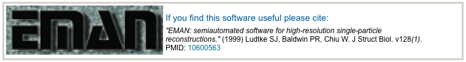
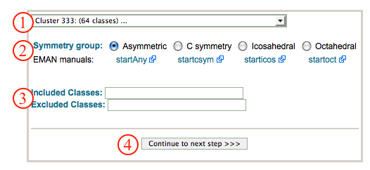
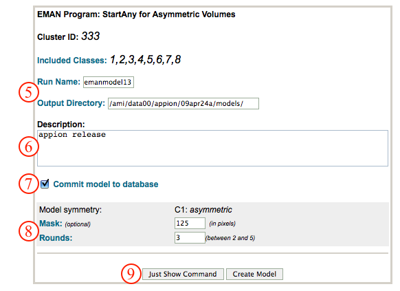
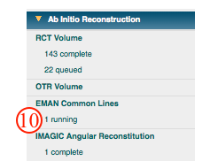
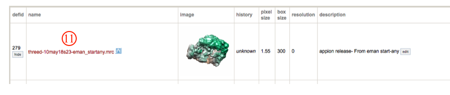
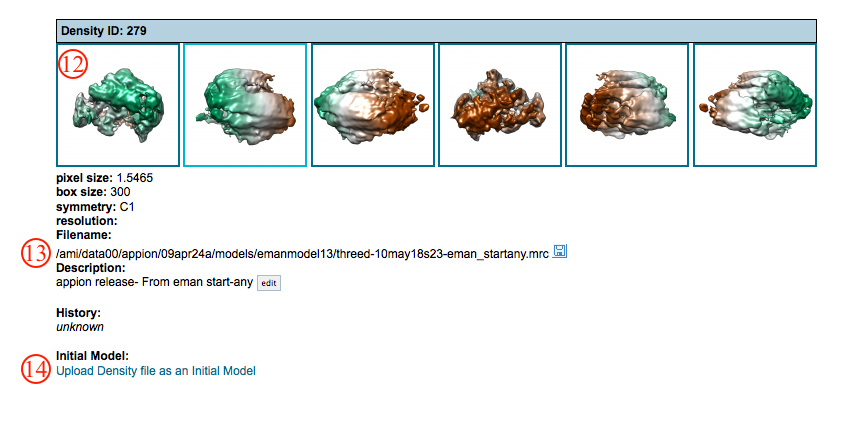

This method relies on the central section theorem, which permits identification of identical intersecting 1D lines for all combinatorial pairs of 2D projections to assign Euler angles needed for 3D reconstruction. This method is only applicable when the specimen does not exhibit preferred orientation.

## General Workflow:

*Note: EMAN Common Lines can be accessed directly from the Appion sidebar, or by clicking on the "Run Common Lines" button displayed above class averages generated through [2D Alignment and Classification](/appion/Appion_Manual/Appion_User_Guide/Appion_Processing/Particle_Alignment)*

1.  Select the clustering run to use for class averages from the drop down menu.
2.  Use the radio buttons to select the symmetry appropriate to your particles. Note the links to EMAN manual pages.
3.  Enter the class averages to include or to exclude during reconstruction.
4.  Click "Continue to next step>>".
    
5.  Make sure that appropriate run names and directory trees are specified. Appion increments names automatically, but users are free to specify proprietary names and directories.
6.  Enter a description of your run into the description box.
7.  Check the commut model to database box.
8.  Specify a mask to use that is larger than your molecule, and the number of rounds to iterate.
9.  Click on "Create Model" to submit your job to the cluster. Alternatively, click on "Just Show Command" to obtain a command that can be pasted into a UNIX shell.
    
10. If your job has been submitted to the cluster, a page will appear with a link "Check status of job", which allows tracking of the job via its log-file. This link is also accessible from the "1 running" option under the "Run RCT Volume" submenu in the appion sidebar. Once the job is finished, an additional link entitled "1 complete" will appear under the "Run EMAN Common Lines" tab in the appion sidebar. Clicking on this link opens a summary of all EMAN Common Lines runs that have been done on this project.
    
11. Click on the EMAN common lines job run name to open a new window containing all relevant alignment and classification information.
    
12. Click on the snapshot images to enlarge in a new window.
13. Access the volume data file at this path
14. Upload the volume to use as an initial model for refinement
    

## Notes, Comments, and Suggestions:

1.  This method is not good if you have preferred orientation.

[< Ab Initio Reconstruction](/appion/Appion_Manual/Appion_User_Guide/Appion_Processing/Ab_Initio_Reconstruction) | [Refine Reconstruction >](/appion/Appion_Manual/Appion_User_Guide/Appion_Processing/Refine_Reconstruction)
