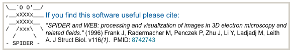

The orthogonal tilt reconstruction method is an approach to generating single-class volumes with no missing cone for ab initio reconstruction of asymmetric particles (Leschziner & Nogales, 2005). The method involves collecting data at +45° and −45° tilts and only requires that particles adopt a relatively large number of orientations on the grid. One tilted data set is used for alignment and classification and the other set---which provides views orthogonal to those in the first---is used for reconstruction, resulting in the absence of a missing cone.

## General Workflow:

### 1. Requirements:

1.  Run either [Auto Align Tilt Pairs](/appion/Appion_Manual/Appion_User_Guide/Appion_Processing/Particle_Selection/Random_Conical_Tilt_Picking/Auto_Align_Tilt_Pairs) or [Align and Edit Tilt Pairs](/appion/Appion_Manual/Appion_User_Guide/Appion_Processing/Particle_Selection/Random_Conical_Tilt_Picking/Align_and_Edit_Tilt_Pairs)
2.  Create two stacks: 1) Consist of only your first exposure particles and 2) Consist of only your second exposure particles
3.  Perform an alignment or classification run of your second-exposure particle stack

### 2. Step by Step Guide:

There are two general methods to run OTR Volume, just like how one would run [RCT Volume](/appion/Appion_Manual/Appion_User_Guide/Appion_Processing/Ab_Initio_Reconstruction/RCT_Volume)

1.  From class averages after running alignment or classification:
    1.  By selecting a desired class average (using the "select" selection mode) and then clicking on the button "Create OTR Volume", the user will be taken to the "Run OTR Volume" launch page.
    2.  On this page, the user will provide the a brief description of the run, select the corresponding stack with respect to the stack on which the alignment or classification is performed and select the mask radius.
    3.  The other options are set on defaults
2.  From the menu tab under Ab Initio Reconstruction:
    1.  By clicking on the OTR Volume link, the user will be taken to the "Run OTR Volume" launch page.
    2.  In this case, since the desired class average is not defined, the user has to choose the alignment or classification run and define the the class average number to reconstruct the OTR volume.
    3.  Once that is done, the rest of the options are exactly the same as launching OTR volume from class averages in Method 1

### 3. Viewing OTR Volume Output Pages:

## Notes, Comments, and Suggestions:

[< Ab Initio Reconstruction](/appion/Appion_Manual/Appion_User_Guide/Appion_Processing/Ab_Initio_Reconstruction) | [Refine Reconstruction >](/appion/Appion_Manual/Appion_User_Guide/Appion_Processing/Refine_Reconstruction)
