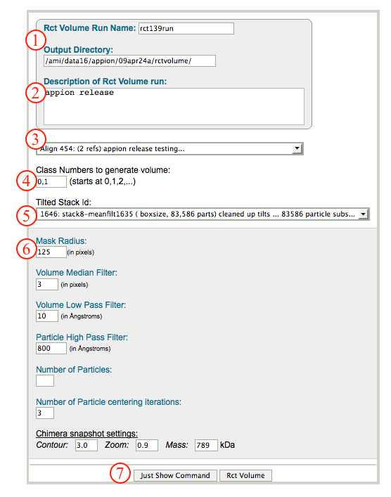
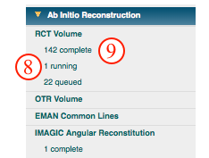
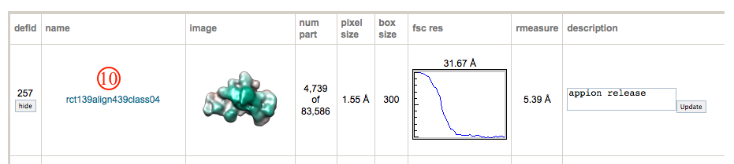
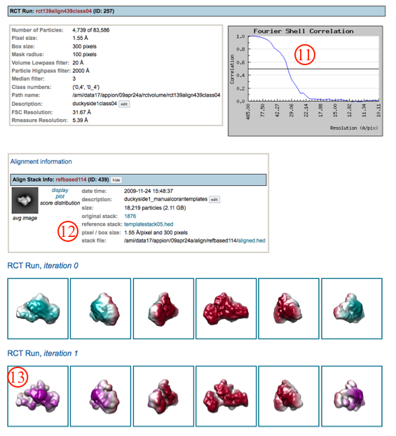

This method relies on physical tilting of the specimen in the microscope to obtain 2D projection views for samples with preferred orientation. Images are taken at 0 and 45-60 degrees. [Alignment and classification](/appion/Appion_Manual/Appion_User_Guide/Appion_Processing/Particle_Alignment) of the 0 degree data determines orientation parameters to be applied to the tilted data. This method was originally described by *Radermacher, M. et. al Journal of Microscopy v141,RP1-2 (1986).*

## General Workflow:

*Note: RCT Volume can be accessed directly from the Appion sidebar, or by clicking on the "Create RCT Volume" button displayed above class averages generated through [2D Alignment and Classification](/appion/Appion_Manual/Appion_User_Guide/Appion_Processing/Particle_Alignment)*

1.  Make sure that appropriate run names and directory trees are specified. Appion increments names automatically, but users are free to specify proprietary names and directories.
2.  Enter a description of your run into the description box.
3.  Select the aligned stack to use for titled particle parameters from the drop down menu. Note that stacks can be identified in this menu by clustering or feature analysis run ID. Also note that there will be no drop down menu for this option if the RCT Volume page was accessed directly from the clustering run output webpage, because these parameters are then already known.
4.  Enter the class numbers to use for volume generation. To decide which classes to use, go look at your alignment/feature analysis/clustering output.
5.  Select the TILTED particle stack to use for the reconstruction.
6.  Specify a mask radius that is barely bigger than the radius of your molecule.
7.  Click on "Rct Volume" to submit your job to the cluster. Alternatively, click on "Just Show Command" to obtain a command that can be pasted into a UNIX shell.
    
8.  If your job has been submitted to the cluster, a page will appear with a link "Check status of job", which allows tracking of the job via its log-file. This link is also accessible from the "1 running" option under the "Run RCT Volume" submenu in the appion sidebar.
9.  Once the job is finished, an additional link entitled "1 complete" will appear under the "Run Feature Analysis" tab in the appion sidebar. Clicking on this link opens a summary of all RCT volume runs that have been done on this project.
    
10. Click on the RCT job run name to open a new window containing all relevant alignment and classification information.
    
11. Click on the FSC graph to enlarge in a new window.
12. Click on the appropriate links to access the raw, template, and aligned stacks of particles that went into this reconstruction.
13. Click on individual snapshots to enlarge in a new window.
    

## Notes, Comments, and Suggestions:

1.  Specifying multiple classes will result in them being combined into a single RCT volume. Capability to launch multiple, separate RCT reconstructions at once coming soon!
2.  The default parameters for median filter, low pass, and high pass can be changed. Number of particles uses only a subset of the data. The chimera settings only dictate the "look" of your output page. It does not alter the final outcome.

[< Ab Initio Reconstruction](/appion/Appion_Manual/Appion_User_Guide/Appion_Processing/Ab_Initio_Reconstruction) | [Refine Reconstruction >](/appion/Appion_Manual/Appion_User_Guide/Appion_Processing/Refine_Reconstruction)
