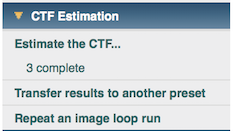
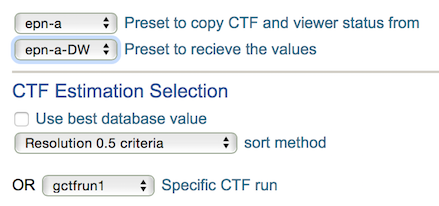
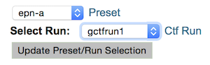

Image formation in EM is distorted by modulation of a contrast transfer function (CTF). Distortion depends on the physical parameters of the microscope, such as keV and lens abberations. Correcting for these aberrations is done by comparing the experimentally observed power spectral density (PSD) of EM images to a theoretically generated CTF.

## Available CTF Procedures:

1.  [Ace Estimation](/appion/Appion_Manual/Appion_User_Guide/Appion_Processing/CTF_Estimation/Ace_Estimation)
2.  [Ace 2 Estimation](/appion/Appion_Manual/Appion_User_Guide/Appion_Processing/CTF_Estimation/Ace_2_Estimation)
3.  [CtfFind Estimation](/appion/Appion_Manual/Appion_User_Guide/Appion_Processing/CTF_Estimation/CtfFind_Estimation)
4.  [gCTF Estimation](/appion/gCTF_Estimation)
5.  [phase plate CTF Estimation](/appion/Appion_Manual/Appion_User_Guide/Appion_Processing/CTF_Estimation/Phase_plate_CTF_Estimation)

## Appion SideBar Snapshot:

## Transfer results to another preset

If you perform dose weighting in your direct detector movie frame alignment. You have both -a and -a-DW images. Typical workflow we recommend is to estimate CTF on undose-weighted -a images to use the contrast of all scattering material, whether ordered or not. If you adopt the workflow but, as typical, want to use the dose-weighted result for further processing. You can transfer the CTF estimation results to -a-DW images.

1.  Choose "Transfer rsults to another preset" in CTF Estimation memu.
2.  Choose the preset you want to transfer from and to
3.  Select option for picking the result to transfer
    1.  For choosing a single run from multiple trials, uncheck "Use best database value" and select your run.
    2.  For choosing the best of all runs based on a criteria, activate "Use best database value" and select "Use all runs".
        ##* If you ran the same method multiple times with different parameters, Use "Software Resolution Estimate" as criteria is recommended for consistency.
        ##* If you ran different method and wish Appion to choose from them, You must not use "Software Resolution Estimate" as it will have bias toward one. All other criteria are generated from independent measures.
4.  submit or copy the resulting command as per typical Appion Loop

## Download Results:

After the run is completed, you may click on " completed" tag under "CTF Estimation" menu to reach the summary page. The statistics is shown for all runs and all presets.

To download results in your preferred format:

1.  scroll down to the section for various download.
2.  select the preset and the run for your download.
3.  **click Update Preset/Run Selection** (very important)
4.  click on the format of the download you desire.

## Notes, Comments, and Suggestions:

[Appion CTF parameter definition](/appion/Appion_CTF_parameter_definition)

If you have a large range of defocus in your data, one parameter set or even one estimation method may not work for all of them. In this case, you can start a separate run but choose a different parameters that only process those with low confidence results. Next appion processing (stack making) will pick the result with highest confidence value image by image to be used. Note that Ace and Ace 2 have in general equivalent confidence values while CtfFind values tend to lower which makes it harder to mix and match currently. See forum http://emg.nysbc.org/redmine/boards/13/topics/990

[< Particle Selection](/appion/Appion_Manual/Appion_User_Guide/Appion_Processing/Particle_Selection) | [Create Particle Stack >](/appion/Appion_Manual/Appion_User_Guide/Appion_Processing/Stacks)
