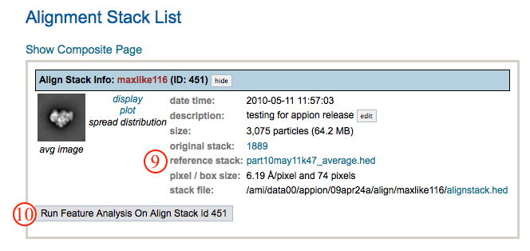
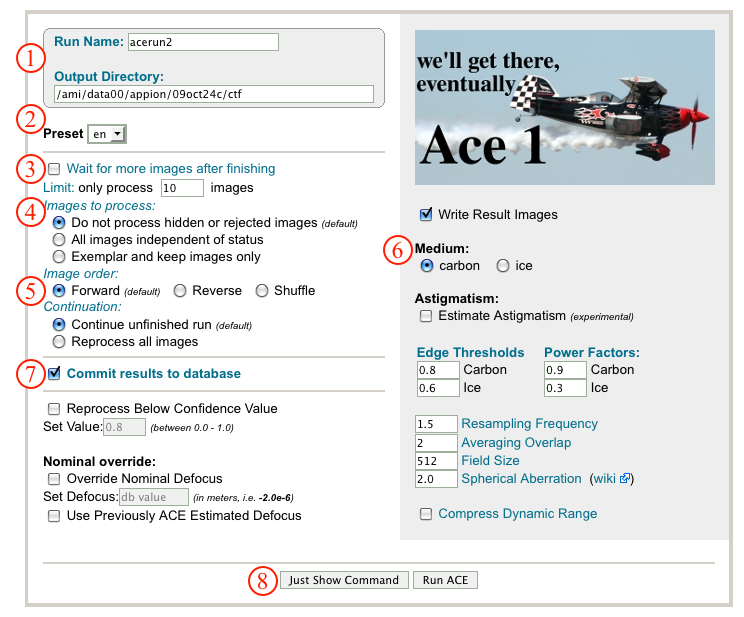
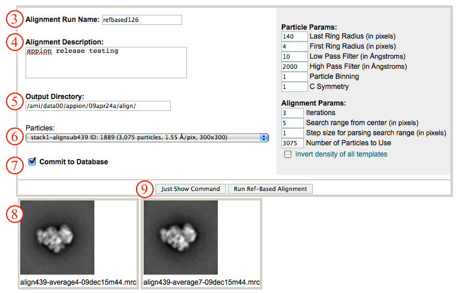

## General Workflow:

1.  Make sure that appropriate run names and directory trees are specified. Appion increments names automatically, but users are free to specify proprietary names and directories.
2.  Select the leginon preset corresponding to the images you'd like to process. Generally "_en" images in leginon are the raw micrographs, but uploaded film data will have a different preset. Selecting "all" will simply process all images.
3.  Check boxes allow the option to run ACE concurrently with data collection. "Wait for more images" will wait until collection times out before stopping ACE processing. The "Limit" box allows restrictions on the number of images to process, which is useful when testing parameters initially.
4.  Radio buttons under "Images to Process" allows a level of pre-processing image filtering. Images that were rejected, hidden, or made exemplars in the image viewer can be included or excluded.
5.  Radio buttons under "Image Order" sets the order in which images are processed and radio buttons under "Continuation" gives the option of continuing or rerunning a previous ACE run.
6.  Select the sample preparation method. Default parameters differ for ice and negative stain.
7.  Make sure that "Commit to Database" box is checked. (For test runs in which you do not wish to store results in the database this box can be unchecked).
8.  Click on "Run ACE" to submit your job to the cluster. Alternatively, click on "Just Show Command" to obtain a command that can be pasted into a UNIX shell.
    
9.  If your job has been submitted to the cluster, a page will appear with a link "Check status of job", which allows tracking of the job via its log-file. This link is also accessible from the "1 running" option under the "Run ACE" submenu in the appion sidebar.
10. Now click on the "1 Complete" link under the "Run ACE" submenu. This opens a summary of all CTF Estimation (Ace 1, Ace 2, CtfFind) runs with a summary histogram of confidence values.
    
11. Clicking on "download ctf data" opens a dialog for exporting CTF Estimation results for use in another application.
12. Clicking on the "acerun#" name opens a summary page of the parameters used for the particular run.
13. The CTF parameters determined by ACE1 can be applied to particles during particle boxing in appion with the [Create Particle Stack](/appion/Appion_Manual/Appion_User_Guide/Appion_Processing/Stacks/Stack_Creation) tool.
    

## Notes, Comments, and Suggestions:

1.  ACE1 does not work on tilted images and can be quite slow.
2.  If multiple ACE1 runs are performed for a single dataset, the Appion stack creation tool will select the CTF parameters determined with the highest confidence value for a particle from a given micrograph.
3.  [Script to run ACE](/appion/Appion_Manual/Appion_User_Guide/Appion_Processing/CTF_Estimation/Ace_Estimation/Ace_script)
4.  [ACE for EMAN](/appion/Appion_Manual/Appion_User_Guide/Appion_Processing/CTF_Estimation/Ace_Estimation/Aceman)

[< CTF Estimation](/appion/Appion_Manual/Appion_User_Guide/Appion_Processing/CTF_Estimation) | [Create Particle Stack >](/appion/Appion_Manual/Appion_User_Guide/Appion_Processing/Stacks)
