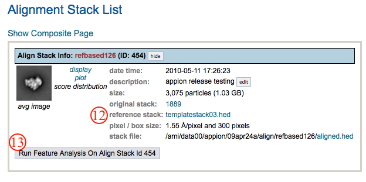
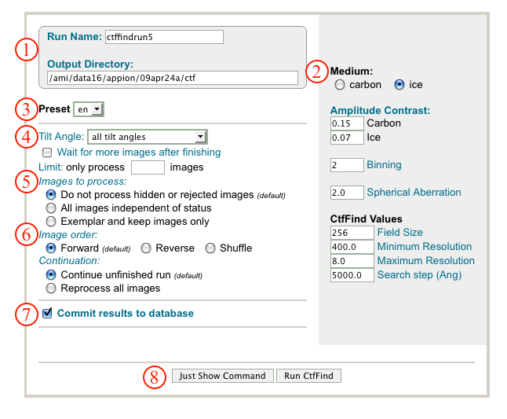
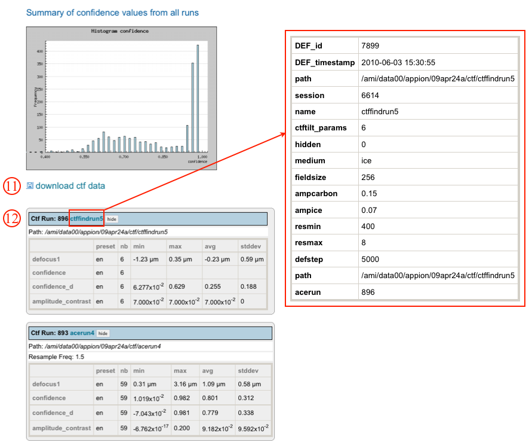

This algorithm works on tilted images.

## General Workflow:

1.  Make sure that appropriate run names and directory trees are specified. Appion increments names automatically, but users are free to specify proprietary names and directories.
2.  Using the radio buttons select carbon or ice medium.
3.  Select the leginon preset corresponding to the images you'd like to process. Generally "_en" images in leginon are the raw micrographs, but uploaded film data will have a different present. Selecting "all" will simply process all images.
4.  A dropdown menu allows the user to specify whether CtfFind will estimate CTF for all tilt angles, zero degree tilt angles, large tilt angles, or small tilt angles. The "Wait for more images" check box turns on the option that will wait until image collection is done before stopping CtfFind processing. The "Limit" box allows restrictions on the number of images to process, which is useful when testing parameters initially.
5.  Radio buttons under "Images to Process" allows a level of pre-processing image filtering. Images that were rejected, hidden, or made exmplars in the image viewer can here be included or exluded.
6.  Radio buttons under "Image Order" sets the order in which images are processed and radio buttons under "Continuation" gives the option of continuing or rerunning a previous CtfFind run.
7.  Make sure that "Commit to Database" box is checked. (For test runs in which you do not wish to store results in the database this box can be unchecked).
8.  Click on "Run CtfFind" to submit your job to the cluster. Alternatively, click on "Just Show Command" to obtain a command that can be pasted into a UNIX shell.
    
9.  If your job has been submitted to the cluster, a page will appear with a link "Check status of job", which allows tracking of the job via its log-file. This link is also accessible from the "1 running" option under the "Run CtfFind" submenu in the appion sidebar.
10. Now click on the "1 Complete" link under the "Run CtfFind" submenu. This opens a summary of all CtfFind runs that have been done on this dataset, including a summary histogram of confidence values for all CTF estimation (Ace, Ace 2, and CtfFind) runs.
    
11. Clicking on "download ctf data" opens a dialog for exporting CTF estimation results for use in another application.
12. Clicking on the "CtfFind#" name opens a summary page of the parameters used for the particular run.
13. The CTF parameters and micrograph tilt estimation determined by CtfFind can be applied to particles during particle boxing in appion with the [Create Particle Stack](/appion/Appion_Manual/Appion_User_Guide/Appion_Processing/Stacks/Stack_Creation) tool.
    

## Notes, Comments, and Suggestions:

1.  If multiple CTF estimation runs are performed for a single dataset, the Appion stack creation tool will select the CTF parameters determined with the highest confidence value (regardless of algorithm used) for a particle from a given micrograph.

[< CTF Estimation](/appion/Appion_Manual/Appion_User_Guide/Appion_Processing/CTF_Estimation) | [Create Particle Stack >](/appion/Appion_Manual/Appion_User_Guide/Appion_Processing/Stacks)
