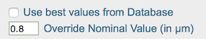
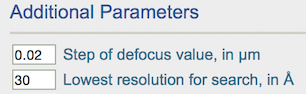
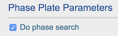

Low defocus CTF estimation can be done with CTFFind4 and gCTF. With a few critical changes of the default parameters:

## Nominal Defocus

Set this to be slightly higher than the defocus used, otherwise the algorithm tend to fit it with lower defocus values and high phase shift.

## Defocus Search Range

Set the step of search range smaller so that it does not extend to very low defocus for the same reason above.

## Lowest Resolution for Search

Because of the much higher contrast from specimen structural factor at low resolution, CTF estimation programs tend to bias phase shift estimation at this edge.
Enter a value at higher resolution than any of these. See the above screenshot as an example.

## Activate phase shift estimation

Activate "Do phase shift"

## Phase Shift Intial Search Range

If the maximal phase shift is known, this value should be adjusted.
