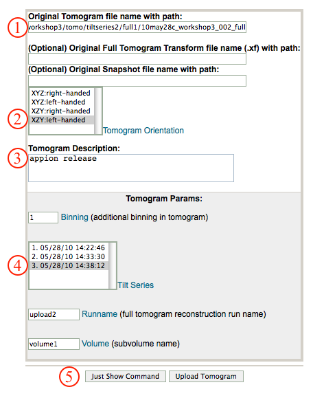

Purpose: Describe tools used for routine quality assessment in Leginon and Appion.

## General Workflow:

1.  *Assess the quality of automated data collection:* In Leginon, the results of any operation can be tested within the interactive GUI prior to target queuing, as, for example, when assessing the hole-finder algorithm. This ensures that optimal criteria are set prior to data collection. Leginon displays output to the user when it encounters errors during data collection, as in the case when an autofocus procedure fails or when the specimen drifts for an extended period of time. At all times, the functional state of the software and all relevant data collection parameters are monitored and tracked using the database to ensure reproducibility in future sessions.
2.  *Assess the quality of the collected data:* Each Leginon session keeps track of statistics during data collection, which are used to assess the quality of the images. For each experiment and for each collected image, Leginon monitors: (a) all instrument parameters associated with the microscope, (b) the duration of collection, © camera readout statistics and electron dose, (d) the magnitude of specimen drift over time, (e) the ice thickness for each hole, (f) image and beam shift values, (g) the accuracy of the autofocus procedure, and several additional parameters. This type of record keeping allows us to track the state of the instruments and analyze the quality of the collected data. [Leginon and Appion Database Tools](/appion/Appion_Manual/Appion_User_Guide/Appion_and_Leginon_Database_Tools).
3.  *Eliminate undesired micrographs or regions:* Images can be manually selected to be "hidden" from view using buttons on the Imageviewer. Note that images can also be marked as "Exemplars". In Appion, "Junk Finding" and "Manual Masking" options exclude undesired areas of the micrograph for particle selection. The "Multi-Image Assessment" tool allows the user to reject entire micrographs, usually after a particle selection run, while the "Image Rejector" function automatically rejects images that either do not have CTF parameters, particle picks, or associated tilt pairs, or are outside a specified fitness factor of defocus range after CTF estimation. Images that have been "rejected" or "hidden" can be optionally excluded from processing runs. Processing runs can also be set to use only "exemplar" images, often useful for testing. Rejected or hidden images, or exemplars, can still be viewed in the Imageviewer by selecting them form the pulldown menu options. Hidden images can be restored while viewing them by selecting the hidden button again. Images are never permanently removed form the database. [Appion Image Viewers](/appion/Appion_Manual/Appion_User_Guide/Appion_and_Leginon_Database_Tools/Image_Viewers).
4.  *Assess the quality of processing algorithms:* Appion's imageviewer allows the user to assess some of the initial steps of image processing. The "ACE" button provides graphical displays of CTF estimation as well as fitting parameters and fitness values. The user can visualize images of the edges detected by the algorithm and compare them to the Thon rings present in the PSD of the image. The "P" button displays all particle picks from the current micrograph for the particle selection run specified by the user. Histograms of confidence scores and correlation values are displayed on the Appion summary pages for CTF estimation and particle picking. [Appion Image Viewer Tools](/appion/Appion_Manual/Appion_User_Guide/Appion_and_Leginon_Database_Tools/Image_Viewers/Common_Features).
5.  *Assess the quality of particle stacks:* Stacks can be directly examined as a montage of particles. Summary pages provide graphical summaries of the intensity and standard deviation of the particle images and these outputs can be useful for cleaning up the stack by rejecting particles on the edge of a hole or over the carbon. The "Xmipp_sort_by_statistics" algorithm can also be used to identify junk particles. During subsequent image processing steps, particles may be rejected based on poor scores within 2D alignment and classification steps, high Euler jumper statistics, or poor correlations for class assignment during 3D refinement. Link to [Appion Particle Stack Tools](/appion/Appion_Manual/Appion_User_Guide/Appion_Processing/Stacks/More_Stack_Tools).
6.  *Assess the accuracy of 2D alignment and classification:* Appion report pages display Eigenimages, variance averages, and/or correlation histograms for each alignment and classification run; some outputs are algorithm dependent. All translations, rotations, and mirror reflections applied to the imges, as well as the coordinates within the original micrograph are stored in the database. [Appion 2D Alignment and Classification Tools](/appion/Appion_Manual/Appion_User_Guide/Appion_Processing/Particle_Alignment).
7.  *Assess veracity of an electron density map:* Appion displays a variety of output related to the reconstruction refinement as an aid in determining the consistency and veracity of the reconstructed map. Refinement runs automatically generate summary pages providing output at each iteration that includes: (a) Resolution derived from the Fourier Shell and Rmeasure criteria, (b) Distribution of Euler angles, © Euler angle differences between the current and previous iteration as well as the average median Euler difference for all iterations, (d) Side-by-side comparison of input projections with associated reprojections of the map, (e) Snapshots of the reconstructed model. [Appion 3D Reconstruction Tools](/appion/Appion_Manual/Appion_User_Guide/Appion_Processing/Ab_Initio_Reconstruction).

## RCT Reconstruction Example of Quality Assessment Pages:

A. RCT reconstructions Summary Page lists all RCT reconstructions completed for the particular dataset

B. Clicking on a particular reconstruction opens a summary page displaying all relevant information for processing steps including and leading up to the reconstruction.

C. A link is provided to a plot summarizing the quality of the 2D alignment preceding the RCT reconstruction.

D. A link to the 2D alignment output opens a page that allows further processing, including selecting a particular stack (green), and viewing its corresponding raw particles (purple). Alternatively, another RCT reconstruction can be calculated, raw particles viewed, or an alternate method utilized to calculate another 3D reconstruction.

E. The raw particles for any stack can be viewed in the web browser with further processing options such as creating a substack by clicking on particular images to include or exclude (red) and then selecting "create substack" (blue).

## Notes, Comments, and Suggestions:

[< Step by Step Guide to Appion](/appion/Appion_Manual/Appion_User_Guide/Appion_Processing/Common_Workflow/Step_by_Step_Guide) | [Processing Cluster Login >](/appion/Appion_Manual/Appion_User_Guide/Appion_Processing/Processing_Cluster_Login)
