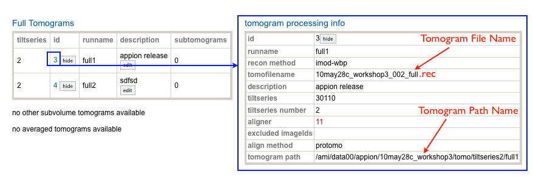

Purpose: Reconstruct a 3-dimensional electron density map in Appion using a streamlined protocol.

## General Workflow:

1.  [Upload Images to a new Project Session](/appion/Appion_Manual/Appion_User_Guide/Appion_and_Leginon_Database_Tools/Project_DB/Upload_Images_to_a_new_Project_Session): Images may be acquired using Leginon or uploaded to the database. "Upload more images" in Appion (Figure, "c") can be used to add more images to an upload session. Real imaging session from Leginon and upload image can not be in the same session.
2.  [View the raw micrographs](/appion/Appion_Manual/Appion_User_Guide/Appion_and_Leginon_Database_Tools/Image_Viewers): Once images are uploaded they are automatically tracked by the database and can be viewed using a web-based Imageviewer. Clicking the "processing" button in the Imageviewer takes the user to the main processing page of Appion (Figure, **b**).
3.  [Select particles](/appion/Appion_Manual/Appion_User_Guide/Appion_Processing/Particle_Selection): Appion provides several methods: "DoG Picker" is a reference-free approach, "Template Correlator" uses the reference-based approach in FindEM, and "Manual Picker" provides for interactive particle picking by the user. An example workflow for particle selection includes: (a) Selecting a subset of particles via DoG Picker or Manual Picker, (b) Aligning and classifying the subset to produce class averages, © Using selected class averages for Template Correlator. Users always have the option of cleaning up picks from any of the automated picking runs using Manual Picker. Overall results are provided on Appion summary pages or can be viewed overlaid on the individual images in the Image viewer by selecting the "P" button (Figure, **a**). As with CTF estimation, particle picking can be started concurrently with image acquisition.
4.  [Estimate the CTF](/appion/Appion_Manual/Appion_User_Guide/Appion_Processing/CTF_Estimation): ACE, and ACE 2 provide fairly robust algorithms for CTF estimation on untilted images that generally require no adjustments to the provided default settings. CTFTilt can be used for CTF estimates on tilted micrographs. A summary of results can be viewed by clicking on the "complete" CTF items in the Appion menu. Results for individual images can also be viewed on the Imageviewer pages, by selecting the "ACE" button. Individual results include graphical overlays, estimated parameters and associated fitness values. We generally find that fitness values of >0.8 are acceptable. CTF correction can be started concurrently with image acquisition; the estimation program once started, will keep querying for new images as they come in.
5.  [Create a particle stack](/appion/Appion_Manual/Appion_User_Guide/Appion_Processing/Stacks): The "Stack Creation" page is used to extract particles from the images based on the picks from a particle selection run, or the picks associated with a previously created and modified stack. Inputs include options for filtering, binning, CTF correction, etc. Particles can be rejected based on CTF fitness parameters, particle correlation values, or defocus range. Results pages provide a summary of the stack, a link to view the stack as individual particles, and further options to clean up the stack using a variety of filters.
6.  [Align the raw particles](/appion/Appion_Manual/Appion_User_Guide/Appion_Processing/Particle_Alignment/Run_Alignment): Reference-free procedures include Xmipp maximum-likelihood and SPIDER reference-free alignment, which can be used to create references for subsequent reference-based alignment. Reference-based procedures include Xmipp reference-based maximum likelihood, SPIDER multi-reference, IMAGIC multi-reference, and EMAN multi-reference alignments. Most procedures can be run initially using default input parameters. The aligned particles can be examined and manipulated further from the summary pages.
7.  [Classify the aligned particles](/appion/Appion_Manual/Appion_User_Guide/Appion_Processing/Particle_Alignment/Run_Feature_Analysis): As with the alignment routines, Appion provides several different options of classification that can be applied to any alignment run. These include: SPIDER Correspondence Analysis, IMAGIC Multivariate Statistics Analysis, or the Xmipp Kerden Self-Organizing Map routine. The specified feature analysis routine locks the user into a clustering procedure, which generates summed class averages. Class averages can be viewed and manipulated further from the summary pages after requesting "View montage as a stack for further processing". Options include viewing the raw particles associated with each class, creating templates or substacks from selected classes or running common lines procedures to create an initial model form selected classes.
8.  [Generate an initial model](/appion/Appion_Manual/Appion_User_Guide/Appion_Processing/Ab_Initio_Reconstruction): Many options are available. Models can be uploaded from the PDB or EMDB, read in from a file, or imported from previously reconstructed datasets. If tilted data has been acquired, it is possible to perform "one-click" RCT or OTR, and tomographic reconstructions from selected 2D class averages or Z-projected subtomogram averages. These options are presented when viewing the stacks or class averages of appropriate datasets. Other options include common-lines approaches either utilizing EMAN's cross-common lines protocol or an automated version of IMAGIC's angular reconstitution. These options are available when viewing class averages or from the Ab Initio Reconstruction menu option.
9.  [Refine](/appion/Appion_Manual/Appion_User_Guide/Appion_Processing/Refine_Reconstruction): Options include procedures using EMAN1, Frealign, or Spider application packages. Results can be viewed on summary pages and more detailed results that provide output for each iteration step including data and graphical output for Resolution curves, Euler angle distributions, snapshots of 3D maps, class averages and particles contributing to the map etc.

## Notes, Comments, and Suggestions:

[< Terminology](/appion/Appion_Manual/Appion_User_Guide/Appion_Processing/Terminology) | [Quality Assessment >](/appion/Appion_Manual/Appion_User_Guide/Appion_Processing/Common_Workflow/Quality_Assessment)
