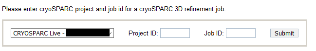
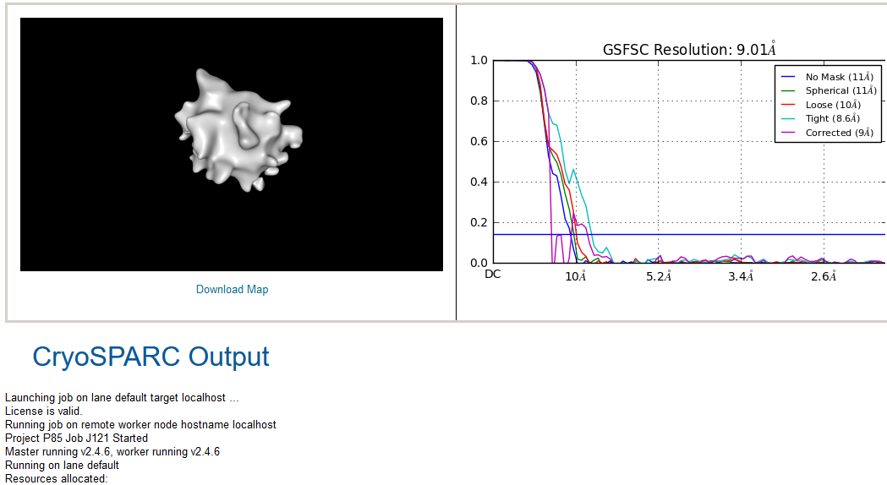
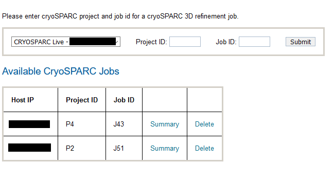

The user is able to display cryoSPARC v2 3D refinement jobs.

## Installing

Install [MongoDB PHP Driver](https://docs.mongodb.com/ecosystem/drivers/php/).

For CentOS 7 our centos7AutoInstallation.py does this.

For CentOS 6, [update to PHP 5.6 on CentOS 6 using remi repository](https://blog.tinned-software.net/update-to-php-5-6-on-centos-6-using-remi-repository/). Then install [MongoDB PHP Driver](https://secure.php.net/manual/en/mongodb.installation.pecl.php).

Add the following lines to your myamiweb/config.php

    // --- cryoSPARC host name and port number. --- //
    $CRYOSPARC_HOSTS[] = array('CRYOSPARC #1' => 'IP1');
    //$CRYOSPARC_HOSTS[] = array('CRYOSPARC #2' => 'IP2');
    define('CRYOSPARC_PORT', "39001");

Replace IP1, with the name or IP address of your host running cryoSPARC v2. You can also replace 'CRYOSPARC #1' with any name. This needs to be a PHP array with 'name' => 'IP' mapping. Please note that 'CRYOSPARC_PORT' in not the port cryoSPARC user interface is running, but the port for MongoDB that is shipped with cryoSPARC. No need to change this. You can verify that MongoDB is listening to this port by running the following command on the host that runs cryoSPARC:

    # netstat -lptu|grep mon
    tcp        0      0 0.0.0.0:39001           0.0.0.0:*               LISTEN      123307/mongod

## Usage

In Appion menu click on cryoSPARC link.

Enter Project and Job ID for a cryoSPARC v2 3D refinement or 2D classification job and click Submit.

This renders a page similar to this one:

In the top left it shows 3D map. Wait for it to load. Depending on your network connection and the size of the map it might take a minute to load the map. Visit http://nglviewer.org/ngl to learn about mouse controls. At the bottom it shows output from cryoSPARC.

Users can go back and add/remove cryoSPARC jobs as show below:

Summary link shows cryoSPARC output similar to above.
