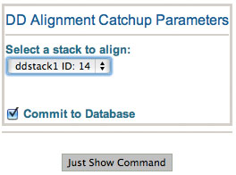

This procedure is to be used with [Gain/Dark correction of the raw frame](/appion/Appion_Manual/Appion_User_Guide/Appion_Processing/Direct_Detector_Frame_Processing/GainDark_correction_of_the_raw_frame_with_or_without_drift_correction) when alignment is required by is deferred to gpu-enabled computers. The resulting aligned sum is uploaded into Leginon as an image under a new preset. If original preset is "ed", then the new preset is named "ed-a". The aligned frame stack overwrites the unaligned frame stack created in the same directory.

This is based on doi:10.1038/nmeth.2472

## General Workflow:

1.  After at least one image has been processed by makeDDRawFrameStack.py and committed to database, choose the ddstack run from the selection box.
2.  Click on "Just Show Command" to obtain a command that can be pasted into a UNIX shell.
3.  Default uses gpu at id 0. To specify gpu id to, for example, 1, append " ---gpuid=1" to the end of the command

## Notes, Comments, and Suggestions:

[^Direct Detector Frame Processing](/appion/Appion_Manual/Appion_User_Guide/Appion_Processing/Direct_Detector_Frame_Processing) | [Gain/Dark correction of the raw frame >](/appion/Appion_Manual/Appion_User_Guide/Appion_Processing/Direct_Detector_Frame_Processing/GainDark_correction_of_the_raw_frame_with_or_without_drift_correction)
