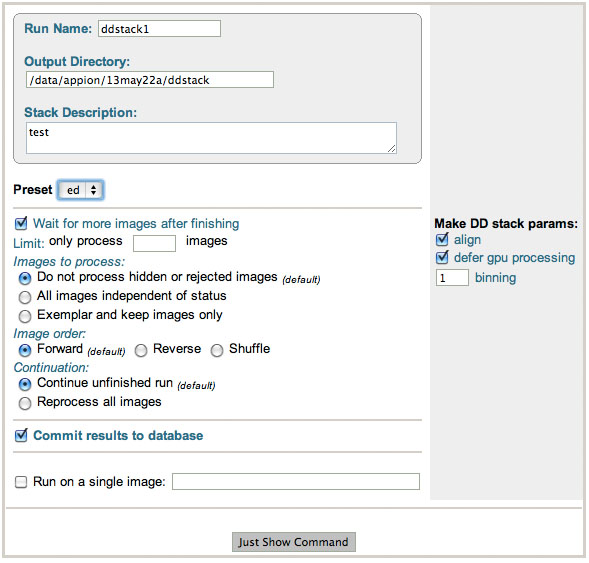

This procedure can perform two things:

## Gain/Dark Corrected Frame Stack Creation

This procedure performs the flat field correction of the movie frames obtained from direct detection camera (DD).

## Motion correction

As an option, the motion between frames can be corrected by shifting one against the other. The resulting aligned sum is uploaded into Leginon as an image under a new preset. If original preset is "ed", then the new preset is named "ed-a".

This is based on doi:10.1038/nmeth.2472

You will need to have Xueming's drift correction program and at least one good GPU and large memory to run it efficiently. In Appion, this program is called dosefgpu_drift. Therefore, you will need to rename the program and make it accessable to you.

## General Workflow:

1.  Make sure that appropriate run names and directory trees are specified. Appion increments names automatically, but users are free to specify proprietary names and directories.
2.  Select the leginon preset corresponding to the images you'd like to process. This has to be a preset that movies were collected. Images without frame saved will be skipped.
3.  Enter a run description.
4.  Specify image looping parameters:
    -   Select the appropriate preset of images to search (default is en if you collected with leginon).
    -   Check boxes allow the option to run the frame stack making concurrently with data collection. "Wait for more images" will wait until collection times out before stopping processing. The "Limit" box allows restrictions on the number of images to process, but is generally unneccessary
    -   Radio buttons under "Images to Process" allows a level of pre-processing image filtering. Images that were rejected, hidden, or made exemplars in the image viewer can be included or excluded.
    -   Radio buttons under "Image Order" sets the order in which images are processed and radio buttons under "Continuation" gives the option of continuing or rerunning a previous run.
    -   Make sure that "Commit to Database" box is checked. (For single image test runs in which you do not wish to store results in the database this box can be unchecked).
5.  Activate "align" check box if frame alignment is to be performed (gpu required if "defer gpu processing" is not checked).
6.  Click on "Just Show Command" to obtain a command that can be pasted into a UNIX shell.

See Notes below on how to improve throughput.

## Notes, Comments, and Suggestions:

### Assign custom aligned preset name

Aligned images uploaded to leginon database has a default preset name that append "-a" to the original name. If you'd like to separate different attempt of alignment, you may add the option ---alignlabel=b to append "-b" instead, for example.

## Parallelization of the running with intermediate files saved locally on a computer with GPU (BEST so far):

It is necessary to parallelize the frame stack making and alignment if it is used during the data collection to create quicker feed back since each process takes about two times longer than the rate of data collection.

Running in parallel, each instance of the run will lock the image it is currently processing so that other instances will take on another image available to it. You can run these in different ways. Here is what works best for us:

We have a computer with GeForce GTX690 (with 2 GPU devices) that also has large system memory . These gpu are dedicated for the process, i.e., not used by the display monitor.

GPU cluster can also be used in similar way by launching the parallel-capable command on separate nodes.

Once the data collection is on the way, and rawtransfer.py has started moving the frames on to file server available to these processing computers, we

1.  Copy the makeDDRawFrameStack.py command generated above to a terminal with "align" activated, and with "defergpu" DEACTIVATED.
2.  Add at the end, ---gpuid=0 ---tempdir=/some_writable_local_directory. See #2399.
3.  Start the process by hitting "return" key on your keyboard.
4.  Paste the exactly same command on another terminal, on the same host with a different ---gpuid, and start that as well.
5.  You can launch this to as many gpu you have, including those on a different computer or cluster node. It is advisable to run these parallel process in different image order. If you always run in "Foward" direction, the most recent image is unlikely to get a chance to be processed. If you always run in "Reverse" direction, most processes would sit and wait for the newest frames to be moved to the file server. We recommend run 1 out of every 3 in "Reverse" order. Default is Forward, add " ---reverse" in the command makes it run in the reverse order.

The bottleneck in this process at NRAMM is rawtransfer.py.

## Parallelization of the gain/dark correction by cpu only (Used when GPU limited):

By default, Appion will use gpu to do gain dark/dark correction, available in the 2.0 version of dosef_gpu_drift_corr. This is most efficient. However, this only works if there is no pixel or column/row defect that need to be corrected. In the case where defect correction is required, cpu based gain/dark correction is performed.

If you are limited by the number of gpus powerful enough for the drift correction programs, you can get maximal parallelization by using computers without gpu capacity to do gain/dark correction by cpu, deferring the actual alignment and then run alignment using the script catchUpDDAlign on the gpu.

Therefore, once the data collection is on the way, and rawtransfer.py has started moving the frames on to file server available to these processing computers, we

1.  Copy the makeDDRawFrameStack.py command generated above to a terminal without gpu with "align" and "defergpu" activated and execute it.
2.  Repeat this on another terminal, either on the same host or not, depending on how much memory and number of cpu there is on the computer.
3.  You can launch this to as many cpu processes you like until it is limited by I/O and data collection speed. It is advisable to run these parallel process in different image order. If you always run in "Foward" direction, the most recent image is unlikely to get a chance to be processed. If you always run in "Reverse" direction, most processes would sit and wait for the newest frames to be moved to the file server. We recommend run 1 out of every 3 in "Reverse" order. Default is Forward, add " ---reverse" in the command makes it run in the reverse order.
4.  Once it is underway, start multiple [Catch up DD frame alignment](/appion/Appion_Manual/Appion_User_Guide/Appion_Processing/Direct_Detector_Frame_Processing/Catch_up_DD_frame_alignment), each assigned to different gpuid if you have multiples.

[<Direct Detector Frame Processing](/appion/Appion_Manual/Appion_User_Guide/Appion_Processing/Direct_Detector_Frame_Processing) | [Catch up DD frame alignment when frame stack making defers the alignment >](/appion/Appion_Manual/Appion_User_Guide/Appion_Processing/Direct_Detector_Frame_Processing/Catch_up_DD_frame_alignment)
