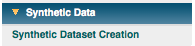
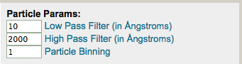
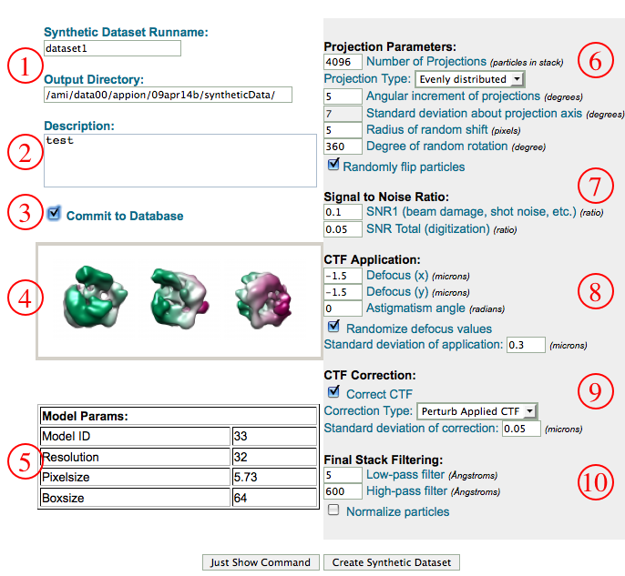
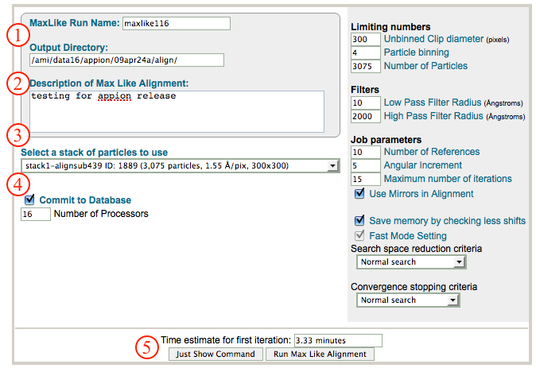

This method uses the IMAGIC M-R-A command to align your particles.

## General Workflow:

1.  Make sure that appropriate run names and directory trees are specified. Appion increments names automatically, but users are free to specify proprietary names and directories.
2.  Enter a description of your run into the description box.
3.  Select the stack to align from the drop down menu. Note that stacks can be identified in this menu by stack name, stack ID, and that the number of particles, pixel and box sizes are listed for each.
4.  Select a template stack that will be used as references. If you do not have a template stack uploaded to the database, you will not be able to use this feature. To upload a template stack (which can be anything, i.e. raw particles, class averages, forward projections, etc., but must be in .img / .hed [IMAGIC] format), click on the "Template Stacks" option in the menu. Once that is complete, you will be able to use this alignment feature.
5.  Make sure that "Commit to Database" box is checked. (For test runs in which you do not wish to store results in the database this box can be unchecked).
6.  Specify the number of processors to use (the feature currently only runs on a single node, but can do so on as many processors as that node has).
7.  Specify whether or not you want to filter the particle, under the "particle parameters" section
    
8.  Do the same in the "Reference Parameters" section. Note that you can threshold the pixel densities of the references to cut off negative (dark) values. If you do not want to threshold the pixel intensities, leave as --999.
    
9.  Specify the alignment procedure, with corresponding alignment parameters. The pop-up menus explain what each parameter means
    
10. Click on "Run Multi Reference Alignment" to submit your job to the cluster. Alternatively, click on "Just Show Command" to obtain a command that can be pasted into a UNIX shell.
11. If your job has been submitted to the cluster, a page will appear with a link "Check status of job", which allows tracking of the job via its log-file. This link is also accessible from the "# running" option under the "Run Alignment" submenu in the appion sidebar.
12. Once the job is finished, an additional link entitled "# complete" will appear under the "Run Alignment" tab in the appion sidebar. Clicking on this link opens a summary of all alignments that have been done on this project.

1.  Click on the "alignstack.hed" link to browse through aligned particles.
2.  To perform a [feature analysis](/appion/Appion_Manual/Appion_User_Guide/Appion_Processing/Particle_Alignment/Run_Feature_Analysis), click on the grey link entitled "Run Feature Analysis on Align Stack Id xxx" within the box that summarizes this alignment run.

## Notes, Comments, and Suggestions:

1.  brute force alignment: This alignment method, available in the pop-up menu, has produced very nice results in test runs. It is obviously very slow, but well worth experimenting with. The higher the value for "number of orientations", the more orientations the algorithm compares, and the slower the alignment (scales linearly).
2.  Clicking on "Show Composite Page" in the Alignment Stack List page (accessible from the "completed" link under "Run Alignment" in the Appion sidebar) will expand the page to show the relationships between alignment, feature analysis, and clustering runs.

[<Run Alignment](/appion/Appion_Manual/Appion_User_Guide/Appion_Processing/Particle_Alignment/Run_Alignment) | [Run Feature Analysis >](/appion/Appion_Manual/Appion_User_Guide/Appion_Processing/Particle_Alignment/Run_Feature_Analysis)
