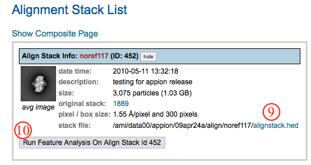

Appion provides various tools for importing 2D images as well as 3D volumes for various usage ranging from templates for alignment to 3D models for model refinement.

## Available Import Tools:

1.  [PDB to Model](/appion/Appion_Manual/Appion_User_Guide/Appion_Processing/Import_Tools/PDB_to_Model)
2.  [EMDB to Model](/appion/Appion_Manual/Appion_User_Guide/Appion_Processing/Import_Tools/EMDB_to_Model)
3.  [Upload Particles](/appion/Appion_Manual/Appion_User_Guide/Appion_Processing/Import_Tools/Upload_Particles)
4.  [Upload Template](/appion/Appion_Manual/Appion_User_Guide/Appion_Processing/Import_Tools/Upload_Template)
5.  [Upload Model](/appion/Appion_Manual/Appion_User_Guide/Appion_Processing/Import_Tools/Upload_Model)
6.  [Upload More Images](/appion/Appion_Manual/Appion_User_Guide/Appion_Processing/Import_Tools/Upload_More_Images)
7.  [Upload Stack](/appion/Appion_Manual/Appion_User_Guide/Appion_Processing/Import_Tools/Upload_Stack)

## Appion Sidebar Snapshot: 

## Notes, Comments, and Suggestions:

[< CTF Estimation](/appion/Appion_Manual/Appion_User_Guide/Appion_Processing/CTF_Estimation) | [Image Assessment >](/appion/Appion_Manual/Appion_User_Guide/Appion_Processing/Image_Assessment)
