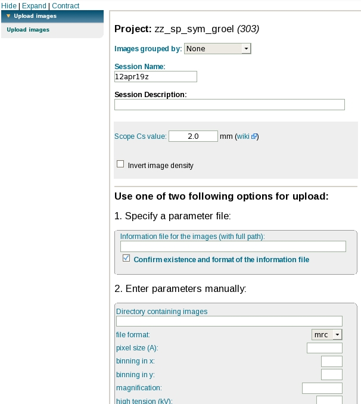

The user is able to upload raw micrographs to either existing or new session to be used in appion processing

## General Workflow:

**To launch:**

**Upload More Images Screen**

1.  For existing session, you can not change session name or description
2.  If it is a tilt series, the user will need to provide the number of images within the tilt series as well as the tilt information in the following parameter file
3.  Following this, the user has the option to upload via specifying a parameter file or enter the fixed parameter manually.

### Specify a Parameter File:

1.  This file has to adhere to the following information:
    1.  complete path and name of micrograph
    2.  pixel size in meters [1.63e-10]
    3.  binning in x [1]
    4.  binning in y [1]
    5.  nominal scope magnification [50000]
    6.  intended defocus in meters [--2e-06]
    7.  high tension in volts [200000]
    8.  (optional) stage alpha tilt in degrees if loading tilt group [55]
    9.  (optional) dose in electrons per Angstrom^2 [20.0] (**Note**: You must include stage alpha tilt if you want to specify this option)
2.  The values for each micrographs should be on the same line separated by tabs:

> > /home/abc/xxx.mrc 1.63e-10 1 1 50000 --2e-06 200000 55

> > /home/abc/xyz.mrc 1.63e-10 1 1 50000 --2e-06 200000 10

### Enter parameters manually:

1.  The user provides the path of the directory containing the images
2.  The user provides the file format
3.  The user provides the pixel size of the micrographs in Angstrom
4.  The user provides the binning in x
5.  The user provides the binning in y
6.  The user provides the magnification
7.  The user provides the defocus in micron
8.  The user provides the high tension of the microscope in kV

For a series of untilted images, it might be easier to enter parametes manually (assuming all your micrographs are in the same directory and all the other informations are the same for each image).

## Image Grouping

### Defocal pair (Webform parameter entry only)

The user will need to make sure the files are organized alphabetically sorted by the group first
For example, image1.mrc=location1/defocus1, image2.mrc=location1/defocus2, image3=location2/defocus1, image4=location2/defocus2 etc.

### RCT tilt pair or defocal pair (Both methods available)

When using webform parameter entry method, the user will need to make sure the files are organized alphabetically sorted by the group first
For example, image1.mrc=location1/tilt1, image2.mrc=location1/tilt2, image3=location2/tilt1, image4=location2/tilt2 etc.

See [Image pair upload for rct](/appion/Appion_Manual/Appion_User_Guide/Appion_and_Leginon_Database_Tools/Project_DB/Upload_Images_to_a_new_Project_Session/Image_pair_upload_for_rct) for more details

### Tomography tilt series (Parameter File method only)

The file entry should be ordered by the tilt series. It is possible to upload a bi-directional (0 to positive tilts and then 0 to negative tilts, for example) tilt series.
Number of images in the tilt group defines the tilt series.

**Output:**

1.  Once the micrographs are uploaded, it will appear in the viewer by choosing the correct session.
2.  The user can then start processing the micrographs using appion.

## Notes, Comments, and Suggestions:

[< Upload Model](/appion/Appion_Manual/Appion_User_Guide/Appion_Processing/Import_Tools/Upload_Model) | [Upload Stack >](/appion/Appion_Manual/Appion_User_Guide/Appion_Processing/Import_Tools/Upload_Stack)
