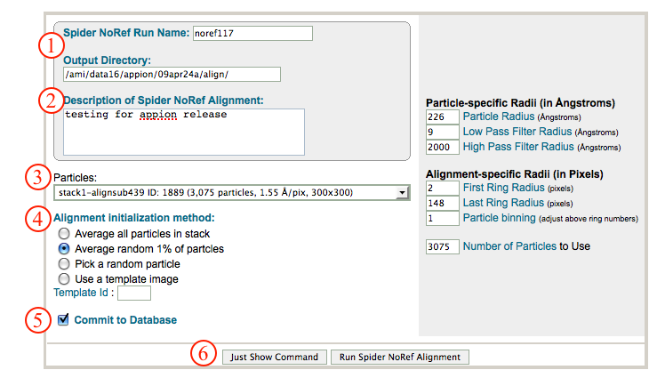
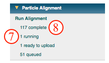

This method uses the Spider AP SR command to align your particles.

## General Workflow:

1.  Make sure that appropriate run names and directory trees are specified. Appion increments names automatically, but users are free to specify proprietary names and directories.
2.  Enter a description of your run into the description box.
3.  Select the stack to align from the drop down menu. Note that stacks can be identified in this menu by stack name, stack ID, and that the number of particles, pixel and box sizes are listed for each.
4.  Select a method for initializing reference-free alignment by activating one of the radio buttons. If you wish to use a template image to initialize alignment, you can locate the template ID number by clicking on "1 available" under "Upload template" in the "Import tools" submenu on the appion sidebar.
5.  Make sure that "Commit to Database" box is checked. (For test runs in which you do not wish to store results in the database this box can be unchecked).
6.  Click on "Run Spider NoRef Alignment" to submit your job to the cluster. Alternatively, click on "Just Show Command" to obtain a command that can be pasted into a UNIX shell.
    
7.  If your job has been submitted to the cluster, a page will appear with a link "Check status of job", which allows tracking of the job via its log-file. This link is also accessible from the "1 running" option under the "Run Alignment" submenu in the appion sidebar.
8.  Once the job is finished, an additional link entitled "1 complete" will appear under the "Run Alignment" tab in the appion sidebar. Clicking on this link opens a summary of all alignments that have been done on this project.
    
9.  Click on the "alignstack.hed" link to browse through aligned particles.
10. To perform a [feature analysis](/appion/Appion_Manual/Appion_User_Guide/Appion_Processing/Particle_Alignment/Run_Feature_Analysis), click on the grey link entitled "Run Feature Analysis on Align Stack Id xxx" within the box that summarizes this alignment run.
    

## Notes, Comments, and Suggestions:

1.  WARNING: this method is very quick (~few minutes), but also very sloppy and does not always do a great job. The only way to obtain decent results is to run several times and compare the results.
2.  Particle-specific Radii parameters: The default values are pretty good, but adjust as you see fit. Make sure that your particle radius is appropriate!
3.  Alignment-specific Radii parameters: These parameters allow you to specify the radius over which alignment will be done. Generally a small first ring radius is used, and a last ring radius that just encompasses the particle is used; however, special samples might require a larger initial ring.
4.  Clicking on "Show Composite Page" in the Alignment Stack List page (accessible from the "completed" link under "Run Alignment" in the Appion sidebar) will expand the page to show the relationships between alignment, feature analysis, and clustering runs.

[<Run Alignment](/appion/Appion_Manual/Appion_User_Guide/Appion_Processing/Particle_Alignment/Run_Alignment) | [Run Feature Analysis >](/appion/Appion_Manual/Appion_User_Guide/Appion_Processing/Particle_Alignment/Run_Feature_Analysis)
