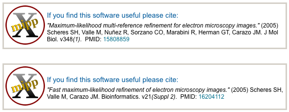
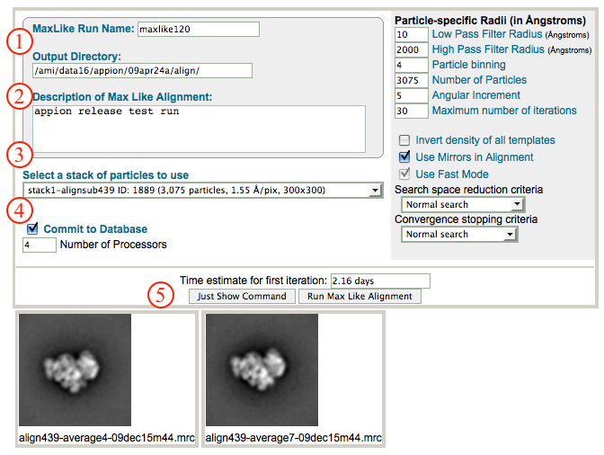
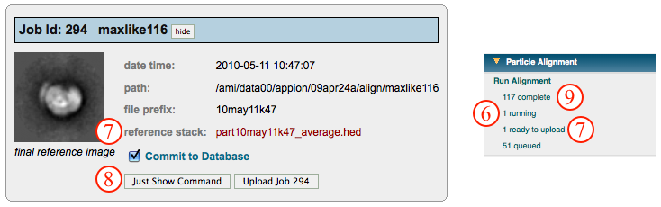
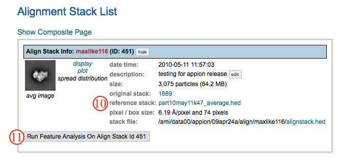

This method is similar to reference-free maximum likelihood but you select templates first.

## General Workflow:

1.  Make sure that appropriate run names and directory trees are specified. Appion increments names automatically, but users are free to specify proprietary names and directories.
2.  Enter a description of your run into the description box.
3.  Select the stack to align from the drop down menu. Note that stacks can be identified in this menu by stack name, stack ID, and that the number of particles, pixel and box sizes are listed for each.
4.  Make sure that "Commit to Database" box is checked. (For test runs in which you do not wish to store results in the database this box can be unchecked).
5.  Click on "Run Maxlike Alignment" to submit your job to the cluster. Alternatively, click on "Just Show Command" to obtain a command that can be pasted into a UNIX shell.
    
6.  If your job has been submitted to the cluster, a page will appear with a link "Check status of job", which allows tracking of the job via its log-file. This link is also accessible from the "1 running" option under the "Run Alignment" submenu in the appion sidebar.
7.  Once the job is finished, an additional link entitled "1 ready to upload" will appear under the "Run Alignment" tab in the appion sidebar. Click on this link, and a page will open with a summary of the run output. Clicking on the link next to "reference stack" will open a new window that shows the class averages obtained via this analysis.
8.  If you are satisfied with the alignment and want to continue processing its output, click on "Upload Job". This shouldn't take too long to finish.
    
9.  Now click on the "1 Complete" link under the "Run Alignment" tab. This opens a summary of all alignments that have been done on this project.
10. Click on the link next to "reference stack" to open a window that shows the class averages and that contains tools for exploring the result. Such tools include the ability to browse through particles in a given class, create templates for reference based alignment, substack creation,3D reconstruction, etc.
11. To perform a [feature analysis](/appion/Appion_Manual/Appion_User_Guide/Appion_Processing/Particle_Alignment/Run_Feature_Analysis), click on the grey link entitled "Run Feature Analysis on Align Stack ID xxx".
    

## Notes, Comments, and Suggestions:

1.  Still untested as to how much bias the reference gives you, but this may be useful in some cases.
2.  When no particles align to a particular template, it goes black and unused in further iterations.
3.  Clicking on "Show Composite Page" in the Alignment Stack List page (accessible from the "completed" link under "Run Alignment" in the Appion sidebar) will expand the page to show the relationships between alignment, feature analysis, and clustering runs.

[<Run Alignment](/appion/Appion_Manual/Appion_User_Guide/Appion_Processing/Particle_Alignment/Run_Alignment) | [Run Feature Analysis >](/appion/Appion_Manual/Appion_User_Guide/Appion_Processing/Particle_Alignment/Run_Feature_Analysis)
