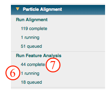

This method uses the Spider CA S command to run correspondence analysis (coran), a form of principal components analysis, and classify your [aligned particles](/appion/Appion_Manual/Appion_User_Guide/Appion_Processing/Particle_Alignment/Run_Alignment).

## General Workflow:

*Note: If you accessed "Run Feature Analysis" directly from an alignment run, you will be greeted by the screen displayed on the left below. Alternatively, if you accessed the "Run Feature Analysis Run" from the Appion sidebar menu, you will be greeted by the screen displayed on the right below.*

1.  Make sure that appropriate run names and directory trees are specified. Appion increments names automatically, but users are free to specify proprietary names and directories.
2.  Enter a description of your run into the description box.
3.  Make sure that "Commit to Database" box is checked. (For test runs in which you do not wish to store results in the database this box can be unchecked).
4.  Check that the appropriate stack of aligned particles are being analyzed, or choose the appropriate stack from the drop-down menu. Note that stacks can be identified in this menu by alignment run name, alignment run ID, and that the number of particles, pixel and box sizes are listed for each.
5.  Click on "Run Spider Coran Classify" to submit your job to the cluster. Alternatively, click on "Just Show Command" to obtain a command that can be pasted into a UNIX shell.
    
6.  If your job has been submitted to the cluster, a page will appear with a link "Check status of job", which allows tracking of the job via its log-file. This link is also accessible from the "1 running" option under the "Run Feature Analysis" submenu in the appion sidebar.
7.  Once the job is finished, an additional link entitled "1 complete" will appear under the "Run Feature Analysis" tab in the appion sidebar. Clicking on this link opens a summary of all feature analyses that have been done on this project.
    
8.  Click on the dendogram to enlarge in a new window.
9.  Click on individial eigen images to enlarge in a new window. Note that the % variance contribution of each eigen image is displayed underneath.
10. To perform a clustering run, click on the grey link entitled "Run Particle Clustering on Analysis Id xxx" within the box that summarizes this alignment run.
    

## Notes, Comments, and Suggestions:

1.  The color (extend of redness) of percent variance contribution is determined by a ratio of the percent variance contribution from eigen image n and the contribution from the lowest factor. In other words, "redness" corresponds to relative extent of contribution to variance.
2.  Clicking on "Show Composite Page" at the top of the Feature Analysis List page (accessible from the "completed" link under "Run Feature Analysis" in the Appion sidebar) will expand the page to show the relationships between alignment runs and feature analysis runs.

[<Run Feature Analysis](/appion/Appion_Manual/Appion_User_Guide/Appion_Processing/Particle_Alignment/Run_Feature_Analysis) | [Run Particle Clustering >](/appion/Appion_Manual/Appion_User_Guide/Appion_Processing/Particle_Alignment/Run_Particle_Clustering)
