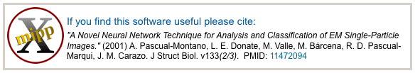
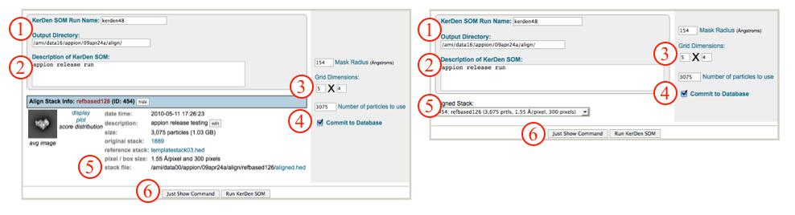

This function applies the Kerden SOM to rotational symmetric particles after [alignment](/appion/Appion_Manual/Appion_User_Guide/Appion_Processing/Particle_Alignment/Run_Alignment). This is especially useful for classifying particles with difference cyclic symmetries.

## General Workflow:

*Note: If you accessed "Run Feature Analysis" directly from an [alignment run](/appion/Appion_Manual/Appion_User_Guide/Appion_Processing/Particle_Alignment/Run_Alignment), you will be greeted by the screen displayed on the left below. Alternatively, if you accessed the "Run Feature Analysis Run" from the Appion sidebar menu, you will be greeted by the screen displayed on the right below.*

1.  Make sure that appropriate run names and directory trees are specified. Appion increments names automatically, but users are free to specify proprietary names and directories.
2.  Enter a description of your run into the description box.
3.  Check and/or change the dimensions of the two-dimensional grid (SOM) of averages that will be the output.
4.  Make sure that "Commit to Database" box is checked. (For test runs in which you do not wish to store results in the database this box can be unchecked).
5.  Check that the appropriate stack of aligned particles are being analyzed, or choose the appropriate stack from the drop-down menu. Note that stacks can be identified in this menu by alignment run name, alignment run ID, and that the number of particles, pixel and box sizes are listed for each.
6.  Click on "Run Spider Coran Classify" to submit your job to the cluster. Alternatively, click on "Just Show Command" to obtain a command that can be pasted into a UNIX shell.
    
7.  If your job has been submitted to the cluster, a page will appear with a link "Check status of job", which allows tracking of the job via its log-file. This link is also accessible from the "1 running" option under the "Run Feature Analysis" submenu in the appion sidebar.
8.  Once the job is finished, an additional link entitled "1 complete" will appear under the "Run Feature Analysis" tab in the appion sidebar. Clicking on this link opens a summary of all feature analyses that have been done on this project.
    

## Notes, Comments, and Suggestions:

1.  Clicking on "Show Composite Page" at the top of the Feature Analysis Procedures page will expand the page to show the relationships between alignment runs and feature analysis runs.
2.  Clicking on "Show Composite Page" in the Feature Analysis List page (accessible from the "completed" link under "Run Feature Analysis" in the Appion sidebar) will expand the page to show the relationships between alignment, feature analysis, and clustering runs.

[<Run Feature Analysis](/appion/Appion_Manual/Appion_User_Guide/Appion_Processing/Particle_Alignment/Run_Feature_Analysis) | [Ab Initio Reconstruction >](/appion/Ab_Initio_Reconstruction_)
