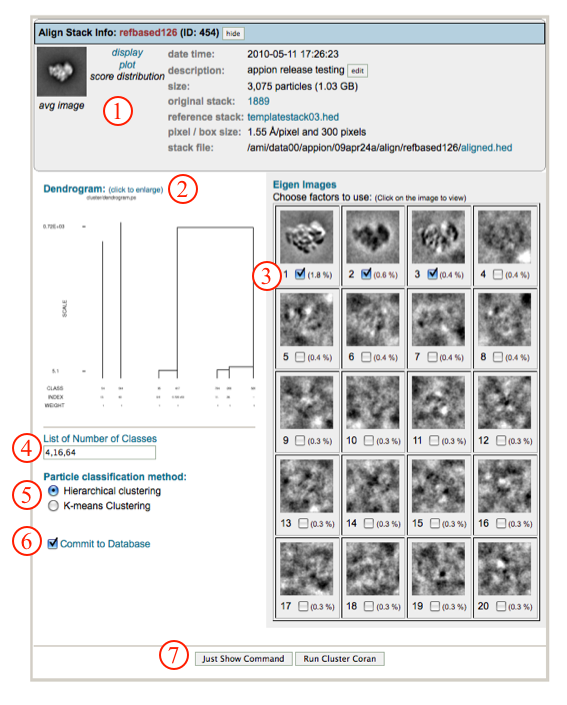
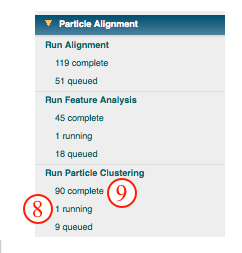
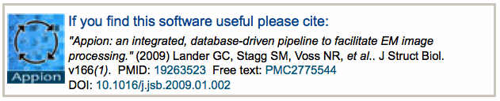

This method clusters particles using k-means or hierarchical ascendancy according to metrics obtained via [feature analysis](/appion/Appion_Manual/Appion_User_Guide/Appion_Processing/Particle_Alignment/Run_Feature_Analysis) procedures such as correspondence analysis.

## General Workflow:

*Note: "Run Particle Clustering" can be accessed directly from a feature analysis run, or via the "Run Particle Clustering" link in the Appion sidebar menu. In the latter case, you will be taken to the list of feature analyses that have been completed, where you can select the feature analysis run which you wish to cluster.*

1.  Check that the appropriate alignment and feature analysis runs have been chosen.
2.  Click on the dendrogram to enlarge.
3.  Select the boxes beneath eigen images that you wish to use for clustering.
4.  Write in a list of numbers of classes to calculate. The default is to calculate 4, 16, and 64 classes.
5.  Use the radio button to select Hierarchical or K-means clustering.
6.  Make sure that "Commit to Database" box is checked. (For test runs in which you do not wish to store results in the database this box can be unchecked).
7.  Click on "Run Cluster Coran" to submit your job to the cluster. Alternatively, click on "Just Show Command" to obtain a command that can be pasted into a UNIX shell.
    
8.  If your job has been submitted to the cluster, a page will appear with a link "Check status of job", which allows tracking of the job via its log-file. This link is also accessible from the "1 running" option under the "Run Particle Clustering" submenu in the appion sidebar.
9.  Once the job is finished, an additional link entitled "1 complete" will appear under the "Run Particle Clustering" tab in the appion sidebar. Clicking on this link opens a summary of all clustering runs that have been done on this project.
    
10. Click on the link corresponding to the number of class averages calculated to view, and/or click on the [variance] link to view 2D variance maps. A new tab will open with additional processing tools.
    
11. In the further processing window, use the boxes and pull down menus to set the range, binning, quality, and info of images to display, and click "load" to affect setting changes.
12. Change the mouse selection mode from exclude (red) to include (green), depending on your needs. Use your mouse to select images to include or exclude. Note that a list of included and excluded images is automatically generated.
13. Select from the options to perform on selected/excluded images. A new tab will open for processing, and the current window will remain open so that you can come back and perform multiple operations.
    

## Notes, Comments, and Suggestions:

1.  The interactive mode of our webpages do not work with the Safari web-browers. Firefox works well.
2.  Clicking on "Show Composite Page" at the top of the Cluster Stack List page will expand the page to show the relationships between alignment runs and feature analysis runs.
3.  Clicking on "Show Composite Page" in the Cluster Stack List page (accessible from the "completed" link under "Run Particle Clustering" in the Appion sidebar) will expand the page to show the relationships between alignment, feature analysis, and clustering runs.

[<Run Particle Clustering](/appion/Appion_Manual/Appion_User_Guide/Appion_Processing/Particle_Alignment/Run_Particle_Clustering) | [Ab Initio Reconstruction >](/appion/Appion_Manual/Appion_User_Guide/Appion_Processing/Ab_Initio_Reconstruction)
