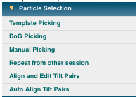

The first step in single particle analysis is to pick the particles within the micrographs. Basically three main ways exist to do this, all of them are integrated within Appion. Based on the shape of the particle, the prior knowledge and the amount of data collected, the user has to make a decision which approach is the best or use different approaches simultaneously and see which works best.

## Available Particle Picking Tools:

1.  [Template Picking](/appion/Appion_Manual/Appion_User_Guide/Appion_Processing/Particle_Selection/Template_Picking)
2.  [Dog Picking](/appion/Appion_Manual/Appion_User_Guide/Appion_Processing/Particle_Selection/Dog_Picking)
3.  [Manual Picking](/appion/Appion_Manual/Appion_User_Guide/Appion_Processing/Particle_Selection/Manual_Picking)
4.  [Repeat from other Session](/appion/Appion_Manual/Appion_User_Guide/Appion_Processing/Repeat_from_other_session)
5.  [Random Conical Tilt Picking](/appion/Appion_Manual/Appion_User_Guide/Appion_Processing/Particle_Selection/Random_Conical_Tilt_Picking)
    1.  [Align and Edit Tilt Pairs](/appion/Appion_Manual/Appion_User_Guide/Appion_Processing/Particle_Selection/Random_Conical_Tilt_Picking/Align_and_Edit_Tilt_Pairs)
    2.  [Auto Align Tilt Pairs](/appion/Appion_Manual/Appion_User_Guide/Appion_Processing/Particle_Selection/Random_Conical_Tilt_Picking/Auto_Align_Tilt_Pairs)

## Appion SideBar Snapshot:

## Notes, Comments, and Suggestions:

[< Processing Cluster Login](/appion/Appion_Manual/Appion_User_Guide/Appion_Processing/Processing_Cluster_Login) | [CTF Estimation >](/appion/Appion_Manual/Appion_User_Guide/Appion_Processing/CTF_Estimation)
