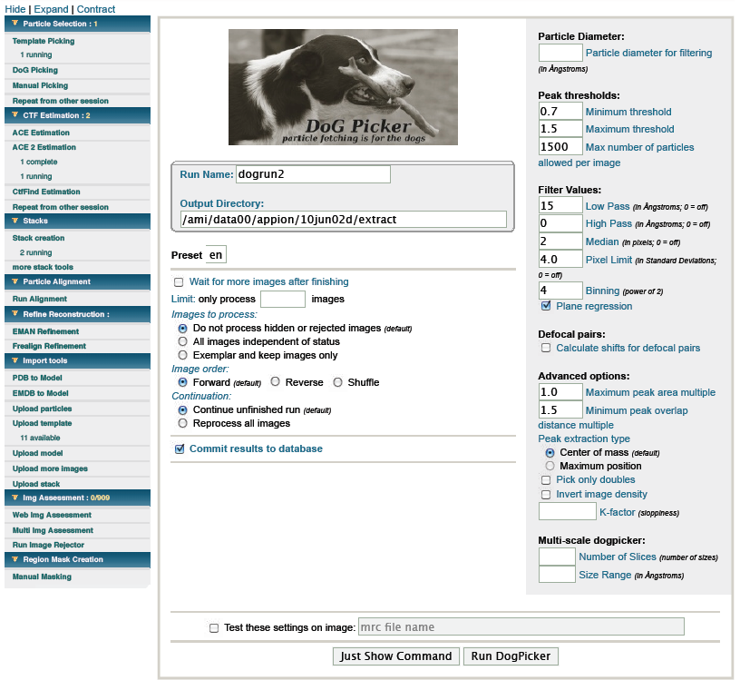

Use Dog Picker if you have no accurate idea of what your particle looks like or you simply want to pick everything (this will include blobs of noise).

## General Workflow:

1.  Test first then submit: Dog picker will pick **white blobs**, so make sure to invert the density if necessary (usually ice images)
    Test the settings on a characteristic image (simply paste the filename of a typical image in the test settings box). To get an idea which parameters suit your data "mouseover" the boxes. There you can find some general estimates which you can use as starting point. During testing you should optimize one parameter at a time and then move on to the next. It is a good idea to optimize the settings on one image and then test a second image. Don't worry about the final boxsize or binning this will be determined in the next step: [stacks](/appion/Appion_Manual/Appion_User_Guide/Appion_Processing/Stacks) !
2.  Click on Run Dog Picker to submit the job: If you submit the job while you are still collecting data use the option: wait for more images after finishing.
3.  Continue with [stacks](/appion/Appion_Manual/Appion_User_Guide/Appion_Processing/Stacks)

## Notes, Comments, and Suggestions:

1.  If you want to rerun the job with identical settings go to [Repeat from other session](/appion/Appion_Manual/Appion_User_Guide/Appion_Processing/Repeat_from_other_session) and select the desired job
2.  Tilt images:
    -   If you have collected tilt pairs, leaving the default Tilt Angle Setting at *all tilt angles* will automatically select corresponding particles.
    -   Examine the results of the Dog run on tilt images using the [RCT viewer](/appion/Appion_Manual/Appion_User_Guide/Appion_and_Leginon_Database_Tools/Image_Viewers/RCT_viewer).

[< Particle Selection](/appion/Appion_Manual/Appion_User_Guide/Appion_Processing/Particle_Selection) | [CTF Estimation >](/appion/Appion_Manual/Appion_User_Guide/Appion_Processing/CTF_Estimation)
