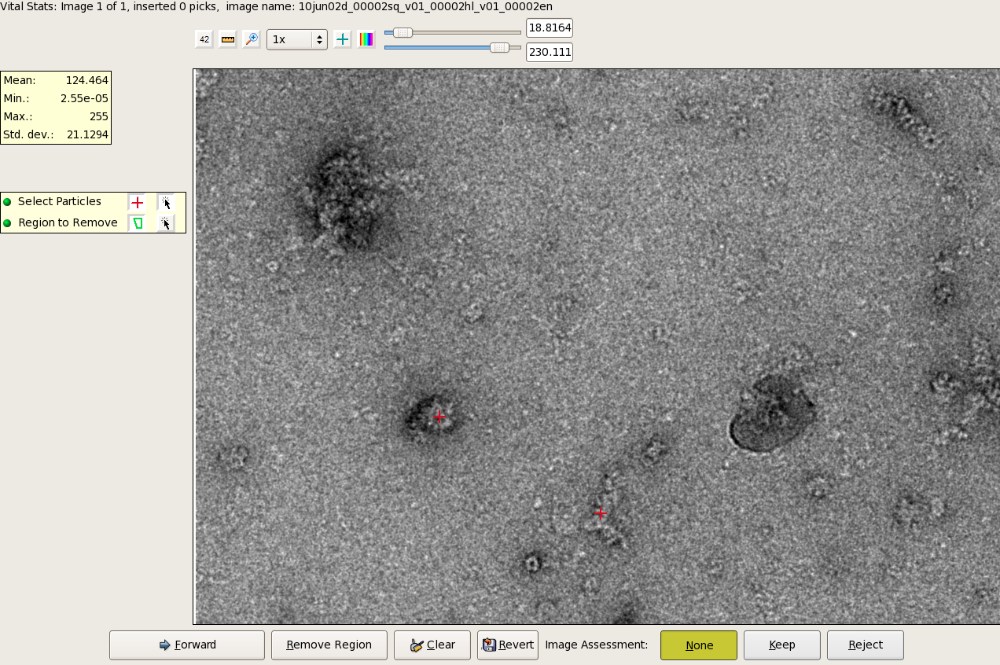

The manual particle picker allows the user to select the targets by eye. This can be extremely time consuming. However, if no starting model is available or the desired particles are represented in a very low concentration it is sometimes worth to spent some time selecting the particles manually. After several hundred particles have been collected a preliminary initial model or 2D averages can be generated and used as templates. Use this option if you want to select the particles manually from scratch or edit particle picks done by [Dog Picking](/appion/Appion_Manual/Appion_User_Guide/Appion_Processing/Particle_Selection/Dog_Picking) or [Template Picking](/appion/Appion_Manual/Appion_User_Guide/Appion_Processing/Particle_Selection/Template_Picking).

## General Workflow:

1.  You have to run this job from a command line.
2.  The images will be preprocessed making particle detection easier. Usually the defaults work extremely well!
3.  Simply click on the desired particles or remove a region of wrongly selected objects by clicking around the area.

## Notes, Comments and Suggestions:

To run the user interface for manual picking, you will be asked to copy and paste the command into a terminal. If you are connecting to a processing server, you may need to ssh with a -X flag to enable display.

[< Particle Selection](/appion/Appion_Manual/Appion_User_Guide/Appion_Processing/Particle_Selection) | [CTF Estimation >](/appion/Appion_Manual/Appion_User_Guide/Appion_Processing/CTF_Estimation)
