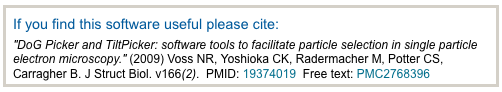
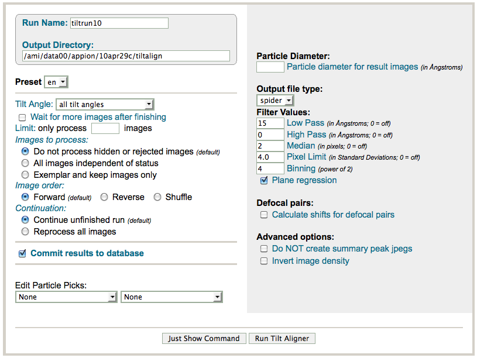

Use this tool if you want to correlate and box the particles of a Random Conical Tilt Session **manually**. Before you can run this program you need to pick the particles with either one of the available picking tools [Dog Picking](/appion/Appion_Manual/Appion_User_Guide/Appion_Processing/Particle_Selection/Dog_Picking), [Manual Picking](/appion/Appion_Manual/Appion_User_Guide/Appion_Processing/Particle_Selection/Manual_Picking) or [Template Picking](/appion/Appion_Manual/Appion_User_Guide/Appion_Processing/Particle_Selection/Template_Picking).

## General Workflow:

1.  If you want to edit particle picks select the desired run
2.  Enter a diameter
3.  Usually the default parameters work pretty good but feel free to play around with them!
4.  Click on "Just Show Command", copy the command, and past it in a Unix shell
5.  Pre-processing of the images can take a little while, but once they are done you can go through images pretty quickly. A window will pop up as shown below.

## Notes, Comments, and Suggestions:

1.  We use the [Auto Align Tilt Pairs](/appion/Appion_Manual/Appion_User_Guide/Appion_Processing/Particle_Selection/Random_Conical_Tilt_Picking/Auto_Align_Tilt_Pairs) function in Appion with great success.
2.  To speed up pre-processing, limit the number of images to process to about 10 at a time, and then use the "continue" option when you run again.
3.  The manual tilt-picker is quite stable, and can be closed at any time without concern. Appion will save the particle picks and image assessment that had been done up until that point, and these can be accessed via the "continue" option.

[< Particle Selection](/appion/Appion_Manual/Appion_User_Guide/Appion_Processing/Particle_Selection)|[CTF Estimation >](/appion/Appion_Manual/Appion_User_Guide/Appion_Processing/CTF_Estimation)
