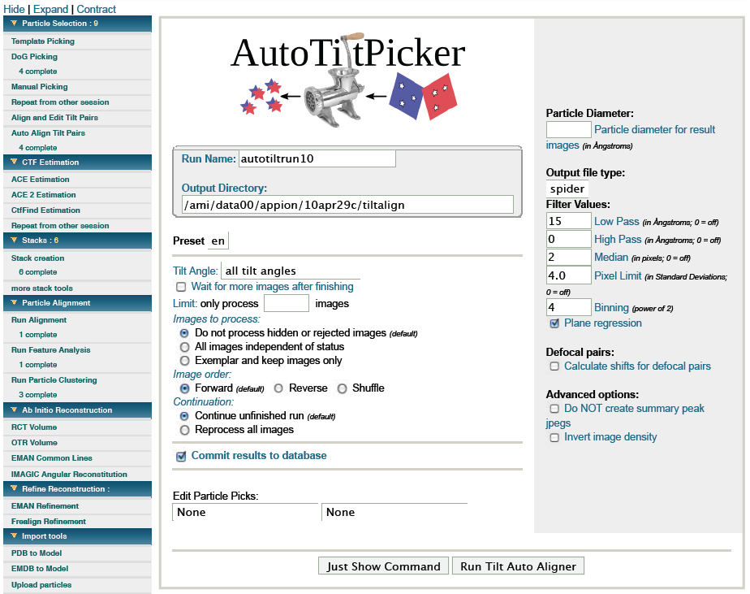

Use this tool if you want to correlate and box the particles of a Random Conical Tilt Session automatically. Before you can run this program you need to pick the particles with either one of the available picking tools [Dog Picking](/appion/Appion_Manual/Appion_User_Guide/Appion_Processing/Particle_Selection/Dog_Picking), [Manual Picking](/appion/Appion_Manual/Appion_User_Guide/Appion_Processing/Particle_Selection/Manual_Picking) or [Template Picking](/appion/Appion_Manual/Appion_User_Guide/Appion_Processing/Particle_Selection/Template_Picking).

## General Workflow:

1.  Decide if you want to box the particles on all tilt angles or just one (f.e. untilted images).
2.  Choose the picking run previously performed.
3.  Usually the default filter parameter work extremely well but feel free to play around with them.
4.  Submit the job.
5.  Once the job is finished, check the quality of tilt pair alignment using the [Multi Image Assessment Tool](/appion/Appion_Manual/Appion_User_Guide/Appion_Processing/Image_Assessment/Multi_Img_Assessment).

## Notes, Comments, and Suggestions:

1.  The *Edit Particle Picks* selection box indicates which particle runs to use for the alignment. You can use a single Dog pick run if *all tilt angles* were used during the run. Alternatively, you may select two particle selection runs, one for each tilt angle.

[< Particle Selection](/appion/Appion_Manual/Appion_User_Guide/Appion_Processing/Particle_Selection)|[Multi Image Assessment >](/appion/Appion_Manual/Appion_User_Guide/Appion_Processing/Image_Assessment/Multi_Img_Assessment)
