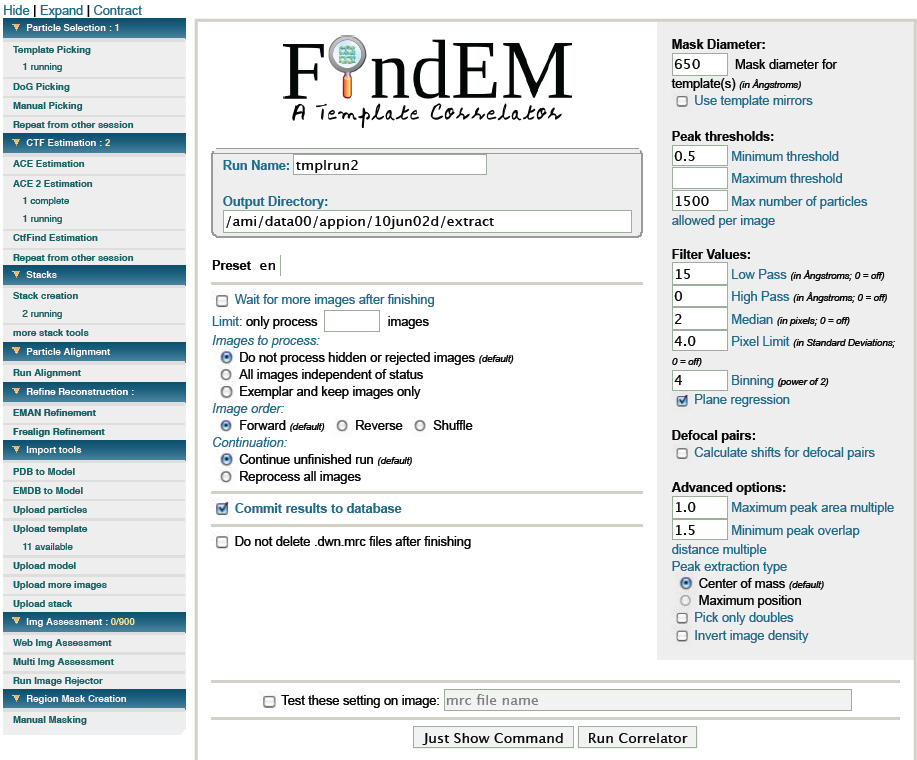

Template picking is usually the most accurate and convenient way to extract particles. Once an initial model or 2D averages have been acquired they can be used as templates to identify similar particles within the micrograph.

## General Workflow:

1.  Choose Templates: Templates are usually created by backprojections of a 3D model or by 2D averages of similar single particles([Upload Template](/appion/Appion_Manual/Appion_User_Guide/Appion_Processing/Import_Tools/Upload_Template)), you can also create them from single 2D images or classaverages (whenever you look at the results of a stack creation (single images) or classification (classaverages) you have the option to select the images you like and click on a Create Templates button). Choose characteristic templates (something like top view, side view and one or two tilted views) and assign an angular increment for the search (a cylindrical view probably needs no rotation at all, a rectangular view something between 0-90deg). Be as accurate as you like but keep in mind that this decision is directly correlated to the processing time required.
2.  Test first then submit: Choose a mask diameter (if you have no idea make it big) and play around with the different parameters (simply paste the filename of a typical image in the test settings box). It is a good idea to optimize the settings on one image and then test a second image. Don't worry about the final boxsize or binning this will be determined in the next step: [stacks](/appion/Appion_Manual/Appion_User_Guide/Appion_Processing/Stacks) !
3.  Click on Run Template Picker to submit the job. If you submit the job while you are still collecting data use the option wait for more images after finishing.
4.  Continue with [stacks](/appion/Appion_Manual/Appion_User_Guide/Appion_Processing/Stacks)

## Notes, Comments, and Suggestions:

1.  If you want to rerun the job with identical settings go to [Repeat from other session](/appion/Appion_Manual/Appion_User_Guide/Appion_Processing/Repeat_from_other_session) and select the desired job
2.  Image size must be a multiple of 2 after your binning for this function and all other functions that use FFT.

[< Particle Selection](/appion/Appion_Manual/Appion_User_Guide/Appion_Processing/Particle_Selection) | [CTF Estimation >](/appion/Appion_Manual/Appion_User_Guide/Appion_Processing/CTF_Estimation)
