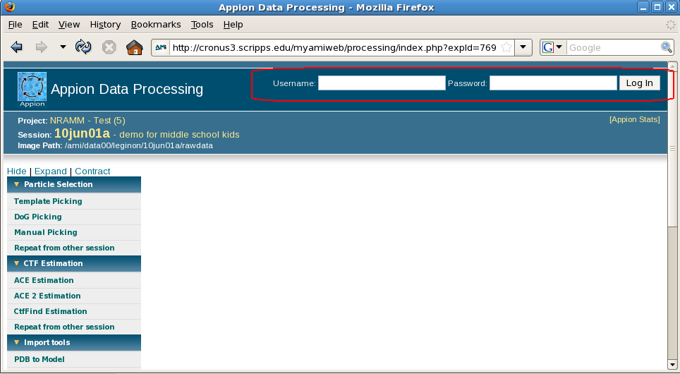

If you want to run processing jobs directly from the Appion Data Proccessing interface, you must log into the processing server with the steps below. You may also choose not to log in. In this case you can copy and paste processing commands directly into a SSH session.

## General Workflow:

1.  When you open the Appion Data Processing interface, notice the Username and Password fields in the upper right corner of the screen.
2.  Enter your username and password. This is **NOT** the same username and password that you use to enter the Appion and Leginon Web Tools interface. You should use appropriate credentials to log into the processing server.

## Notes, Comments, and Suggestions:

[< Common Workflow](/appion/Appion_Manual/Appion_User_Guide/Appion_Processing/Common_Workflow) | [Particle Selection >](/appion/Appion_Manual/Appion_User_Guide/Appion_Processing/Particle_Selection)
