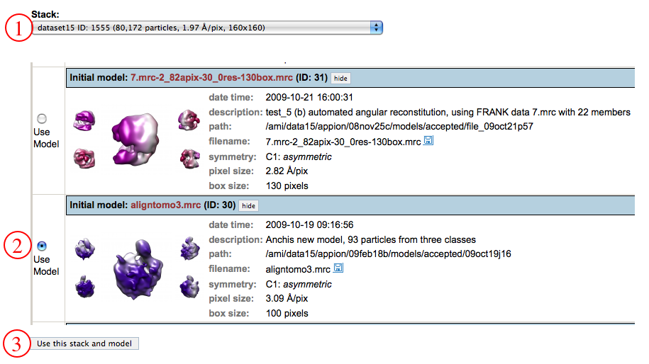
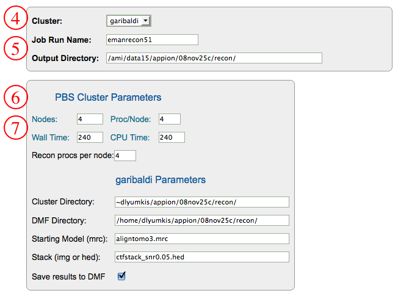
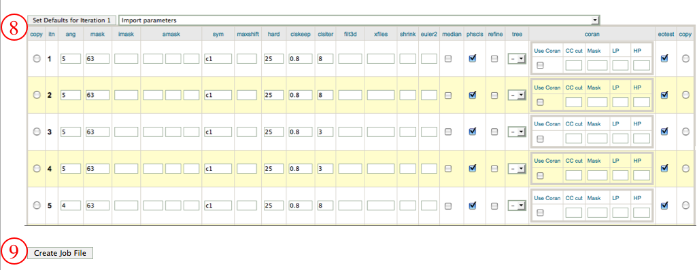
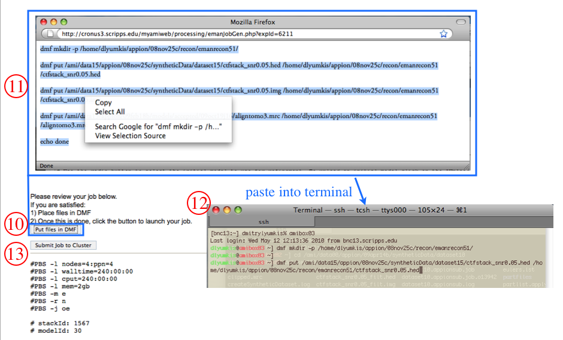
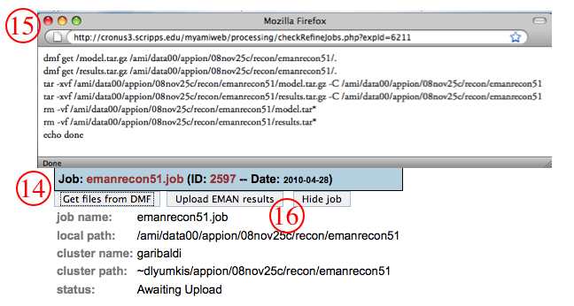
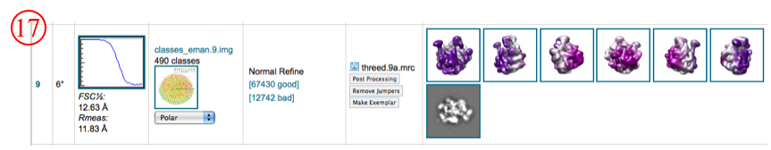

## General Workflow:

1.  Select the CTF corrected stack of particles to use for refinement using "Use Stack" radio button and click on "Use selected models(s)."
2.  Use the radio button to select the initial model to use for refinement. To upload an initial model click on the "Upload a new initial model" link or use one of the [Import Tools](/appion/Appion_Manual/Appion_User_Guide/Appion_Processing/Import_Tools) in the Appion Sidebar.
3.  Click "Use this stack and model" to proceed to the next step.
    
4.  Select the cluster to which you would like to submit this job.
5.  Check the Run Name and Output Directory.
6.  Set cluster parameters as is appropriate.
7.  double check the number of nodes and processors per node to be allocated for the reconstruction within the cluster and check wall and CPU time parameters. The "Recon procs per node" option refers to the number of **EMAN reconstruction processors** per node, NOT the amount of processors allocated to the job, which can be more.
    
8.  Set specific EMAN parameters. Use the mouse to point to an individual parameter, and a help-box will float above that option giving the required information for the user to choose the parameters. It is possible to set default parameters for the first iteration by clicking on the "Set Defaults for Iteration 1" box, then copy the iteration by clicking on the "copy" radio button and modifying the parameters for the subsequent iteration as necessary. Within NRAMM we have experimented with several default refinement schemes, and have provided standard parameters for GroEL-type molecules, icosahedral viruses, and mostly asymmetric molecules such as the ribosome. Specifying one of these options under the "Import Parameters" dropdown toolbox will set basic default parameters for similar molecules.
9.  Click "Create Job File". This opens another window containing directions for final submission of the refinement. Below the directions, a copy of the job file is displayed.
    
10. Click "Put files in DMF". This opens a pop-up window containing DMF commands.
11. Copy the dmf commands.
12. Open a terminal, and paste the dmf commands.
13. Now click on "Submit job to Cluster." You can setup your Appion account such that you get email updates for refinements.
    
    If your job has been submitted to the cluster, a page will appear with a link "Check status of job", which allows tracking of the job via its log-file. This link is also accessible from the "# running" option under the "EMAN Refinement" submenu in the appion sidebar. Once the job is finished, an additional link entitled "# complete" will appear under the "EMAN Refinement" submenu in the appion sidebar.
14. When the job is finished, the files need to be transfered back to the main filesystem in a similar manner as before.
15. Copy the command and paste into terminal
16. Once the files are transferred back, the "Upload EMAN results" button takes you to the page that uploads all the reconstruction results to the database
    
17. For each refinement, the summary page automatically displays for each iteration information such as the FSC curve, Euler angle distributions, good and bad classes, 3D snapshots of the model, and allows for numerous post-processing procedures
    

## Notes, Comments, and Suggestions:

[< Refine Reconstruction](/appion/Appion_Manual/Appion_User_Guide/Appion_Processing/Refine_Reconstruction)|[Quality Assessment >](/appion/Appion_Manual/Appion_User_Guide/Appion_Processing/Common_Workflow/Quality_Assessment)
