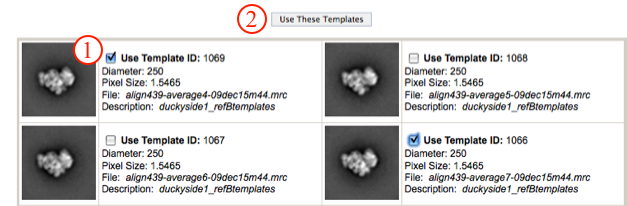
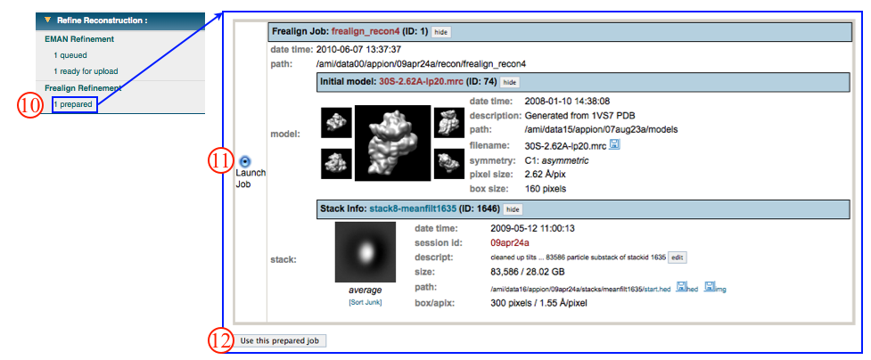
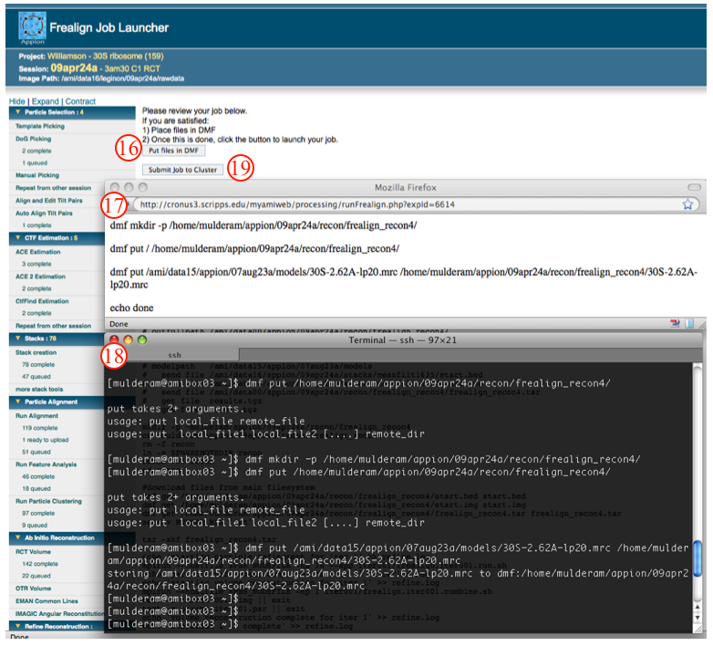

## General Workflow:

1.  Decide which EMAN reconstruction you want to use to import initial orientations. Note the ID number and stack info.
2.  Go to "Stack Creation" and follow the general workflow to create a new stack [Stack creation](/appion/Appion_Manual/Appion_User_Guide/Appion_Processing/Stacks/Stack_Creation/) with the following exceptions:
    > * Step 2. Select the same stack used for the EMAN reconstruction from the "Stacks" drop down menu.
    > * Step 4. Make the boxsize and binning factor the same as the selected stack in step 2.
    > * Step 10. UNcheck the "invert image density" box if you collected ice data. Frealign requires a black on white stack; check or uncheck the box accordingly.
    > * Step 11. UNcheck "Ctf Correct Particle Images". Frealign requires a non-ctf corrected stack.

Once the stack is created, go back to "Frealign Refinement"

1.  Select the non-CTF corrected, density inverted stack from the dropdown menu.
2.  Select the non-CTF corrected stack of particles to use for the final reconstruction from the dropdown menu.
3.  Use the radio button to select the initial model to use for refinement. To upload an initial model click on the "Upload a new initial model" link or use one of the [Import Tools](/appion/Appion_Manual/Appion_User_Guide/Appion_Processing/Import_Tools) in the Appion Sidebar. The initial model does NOT need have the density inverted.
4.  Click "Use this stack and model" to proceed to the next step.
    
5.  Check the Run Name and Output Directory.
6.  Use the radio button to choose initial orientation parameters. These can be imported from a previously run EMAN reconstruction, or determined by Frealign.
7.  Set cluster parameters as is appropriate.
8.  Set specific Frealign parameters. Use the mouse to point to an individual parameter, and a help-box will float above that option giving the required information for the user to choose the parameters.
9.  Click "Prepare Frealign" to submit to the cluster. Alternatively, click "Just Show Command" in order to get a command that can be pasted into a unix shell. If your job has been submitted to the cluster, a page will appear with a link "Check status of job", which allows tracking of the job via its log-file. This link is also accessible from the "1 running" option under the "Frealign Refinement" submenu in the appion sidebar.
    
10. Once the job is finished, an additional link entitled "1 prepared" will appear under the "Frealign Refinement" tab in the appion sidebar. Click on this link.
11. Use the radio button to choose the prepared frealign job you want to launch.
12. Click "Use this prepared job" to proceed to the next step.
    
13. Select the cluster to which you would like to submit this job.
14. Check wall and CPU time parameters.
15. Click "Show Job File". This opens another window containing directions for final submission of the refinement. Below the directions, a copy of the job file is displayed.
16. Click "Put files in DMF". This opens a pop-up window containing DMF commands.
    
17. Copy the dmf commands.
18. Open a terminal, and paste the dmf commands.
19. Now click on "Submit job to Cluster." You can setup your Appion account such that you get email updates for refinements.
    
20. If your job has been submitted to the cluster, a page will appear with a link "Check status of job", which allows tracking of the job via its log-file. This link is also accessible from the "1 running" option under the "Frealign Refinement" submenu in the appion sidebar. Once the job is finished, an additional link entitled "1 complete" will appear under the "Frealign Refinement" submenu in the appion sidebar.

## Notes, Comments, and Suggestions:

[< Refine Reconstruction](/appion/Appion_Manual/Appion_User_Guide/Appion_Processing/Refine_Reconstruction)|[Quality Assessment >](/appion/Appion_Manual/Appion_User_Guide/Appion_Processing/Common_Workflow/Quality_Assessment)
