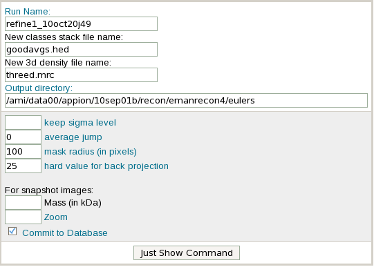

For each refinement, the Reconstruction summary page automatically displays for each iteration information such as the FSC curve, Euler angle distributions, good and bad classes, 3D snapshots of the model, and allows for the following post-processing procedures.

## Remove Jumpers

Remove Jumpers will remove particles with ambiguous orientation.

1.  Select the Remove Jumpers button found under the density column of your refinement iteration information.
2.  Change the value of the **Average Jump** field to the average median Euler jump. If this is left as 0, no particles will be removed.

[< Refine Reconstruction](/appion/Appion_Manual/Appion_User_Guide/Appion_Processing/Refine_Reconstruction) | [Quality Assessment >](/appion/Appion_Manual/Appion_User_Guide/Appion_Processing/Common_Workflow/Quality_Assessment)
