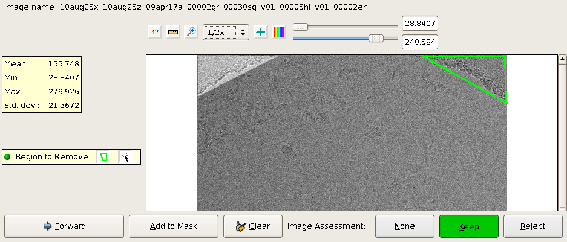

Manual masking is used to mask out regions of cruds on micrographs such that particles picked in the masked out regions will not be used in subsequent processing (e.g. stack creation).

## General Workflow:

**The user selects the option of:**

1.  Assess run of the same name (default)
2.  Combined run with existing assessment run (rarely used now)
3.  Assess run under a new name

**Next:**

1.  The user clicks on either "show command" or "run manual masking", which will then show the command
2.  The user will need to launch the program from a terminal
3.  The interface of manual masking is similar to manual picker or tilt picker, except that instead of picking particles, the user will draw polygons to define the mask
    
4.  Another mask region can be selected after the first polygon region is added to the mask.
5.  The mask is saved when the user click "Forward" to proceed on to the next image

**Output:**

1.  The masking results can be used as a filter when making a stack of particles
2.  The user chooses the desired masking session to apply for filtering out unwanted particle picks

## Notes, Comments, and Suggestions:

_

[< Region Mask Creation](/appion/Appion_Manual/Appion_User_Guide/Appion_Processing/Region_Mask_Creation)

_
