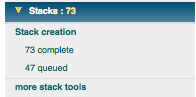

After particle selection, individual particles are boxed out of the micrographs and placed into stack files for further processing.

## Available Stack Tools:

-   [Stack Creation](/appion/Appion_Manual/Appion_User_Guide/Appion_Processing/Stacks/Stack_Creation): Box particles selected from micrographs. Apply CTF and Astigmatism correction.
-   [More Stack Tools](/appion/Appion_Manual/Appion_User_Guide/Appion_Processing/Stacks/More_Stack_Tools): Center, filter, clean-up, mask, etc particle stacks.
    -   [Combine Stacks](/appion/Appion_Manual/Appion_User_Guide/Appion_Processing/Stacks/More_Stack_Tools/Combine_Stacks)
    -   [View Stacks](/appion/Appion_Manual/Appion_User_Guide/Appion_Processing/Stacks/More_Stack_Tools/View_Stacks)
    -   [Alignment SubStacks](/appion/Alignment_SubStacks)
    -   [Jumpers SubStack](/appion/Appion_Manual/Appion_User_Guide/Appion_Processing/Stacks/More_Stack_Tools/Jumpers_SubStack)
    -   [Convert Stack into Particle Picks](/appion/Appion_Manual/Appion_User_Guide/Appion_Processing/Stacks/More_Stack_Tools/Convert_Stack_into_Particle_Picks)

## Appion SideBar Snapshot:

## Notes, Comments, and Suggestions:

[< CTF Estimation](/appion/Appion_Manual/Appion_User_Guide/Appion_Processing/CTF_Estimation) | [Particle Alignment >](/appion/Appion_Manual/Appion_User_Guide/Appion_Processing/Particle_Alignment)
