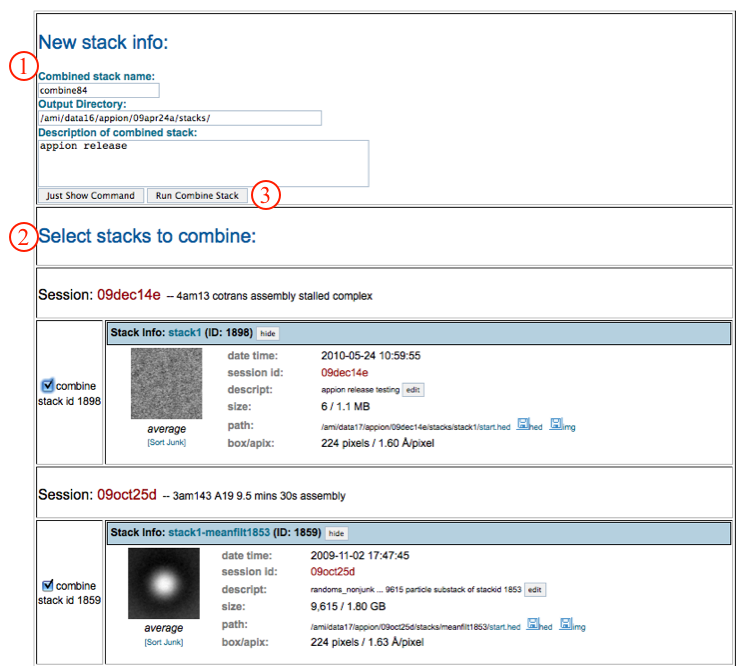

Use this option if you want to combine stacks you [already created](/appion/Appion_Manual/Appion_User_Guide/Appion_Processing/Stacks/Stack_Creation) (for example stacks from two different sessions). Simply select the stacks you want from the list and submit the job.

## General Workflow:

1.  Check the new combined stack name, output directory path, and enter a description.
2.  Select the stacks to combine by checking the appropriate check-boxes. Stacks from different sessions can be combined, and there is not a limit on the number of different stacks that can be combined.
3.  Click on "Run Combine Stack" to submit to the cluster. Alternatively, click on "Just Show Command" to obtain a command that can be copied and pasted into a unix shell.
    
4.  If your job has been submitted to the cluster, a page will appear with a link "Check status of job", which allows tracking of the job via its log-file. This link is also accessible from the "1 running" option under the "Stacks" submenu in the appion sidebar.
5.  Once the job is finished, an additional link entitled "1 complete" will appear under the "Stacks" tab in the appion sidebar. Clicking on this link opens a summary of all stack runs that have been done on this project.

## Notes, Comments, and Suggestions:

1.  You cannot yet combine stacks of different pixel sizes. For this, reset the pixel size and box size for your stack, then use the [Upload Stack](/appion/Appion_Manual/Appion_User_Guide/Appion_Processing/Import_Tools/Upload_Stack) tool, followed by combine stacks.

[<More Stack Tools](/appion/Appion_Manual/Appion_User_Guide/Appion_Processing/Stacks/More_Stack_Tools) | [Particle Alignment >](/appion/Appion_Manual/Appion_User_Guide/Appion_Processing/Particle_Alignment)
