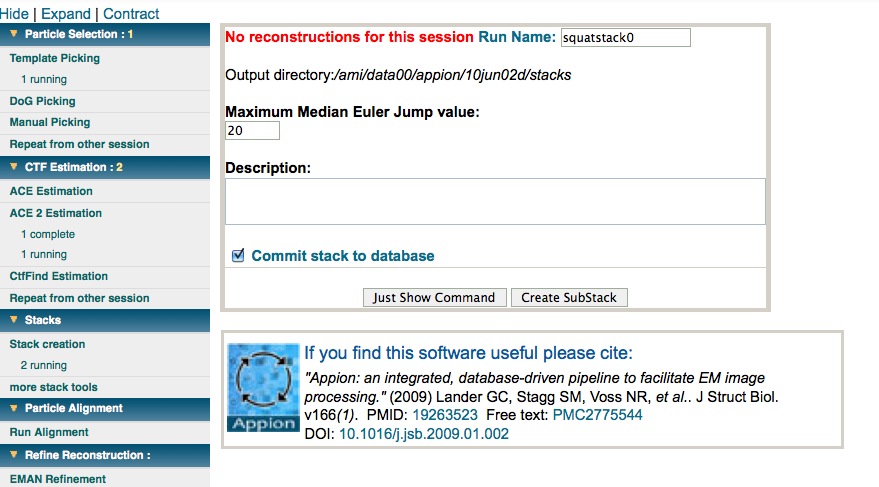

This option allows to exclude particles which are referred to as Euler jumpers. An Euler jumper is a particle which changed the orientation from iteration to iteration. By using this method you can clean up your dataset from particles that do not converge to a single Euler angle assignment.

[<More Stack Tools](/appion/Appion_Manual/Appion_User_Guide/Appion_Processing/Stacks/More_Stack_Tools) | [Particle Alignment >](/appion/Appion_Manual/Appion_User_Guide/Appion_Processing/Particle_Alignment)
