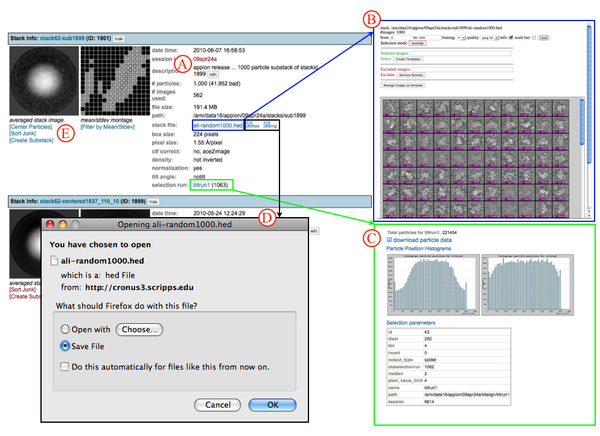

This option takes the user to the stack summary page, which is also accessible from the "X Complete" link under the "Stack" submenu in the Appion SideBar.

## Description and Options Available:

-   A. The stack description can be edited by clicking on the "edit" button.
-   B. The raw stack particles can be viewed in an independent web browser window by clicking on the "stackname" link. The new window contains options for stack manipulation such as excluding certain particles or creating templates for alignment and particle selection.
-   C. Clicking on the "selection run name" link opens a summary page for the particle picking runs that were used to create this stack. The new window contains options for downloading particle data to your local machine, viewing selection run histograms, and a summary of the input parameters used during particle picking.
-   D. Clicking on the ".hed" or ".img" disk image links next to the stack file name opens a window for downloading stack particles to your local machine.
-   E. Several options exist for filtering particle stacks:
    -   [Filter by Mean/Stdev](/appion/Appion_Manual/Appion_User_Guide/Appion_Processing/Stacks/More_Stack_Tools/View_Stacks/Filter_by_MeanStdev)
    -   [Center Particles](/appion/Appion_Manual/Appion_User_Guide/Appion_Processing/Stacks/More_Stack_Tools/View_Stacks/Center_Particles)
    -   [Sort Junk](/appion/Appion_Manual/Appion_User_Guide/Appion_Processing/Stacks/More_Stack_Tools/View_Stacks/Sort_Junk)
    -   [Create Substack](/appion/Appion_Manual/Appion_User_Guide/Appion_Processing/Stacks/More_Stack_Tools/View_Stacks/Create_Substack)
        

## Notes, Comments, and Suggestions:

[<More Stack Tools](/appion/Appion_Manual/Appion_User_Guide/Appion_Processing/Stacks/More_Stack_Tools) | [Particle Alignment >](/appion/Appion_Manual/Appion_User_Guide/Appion_Processing/Particle_Alignment)
