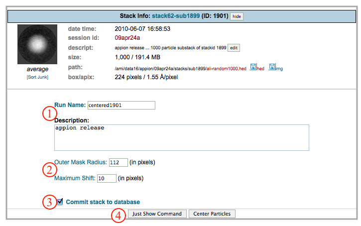
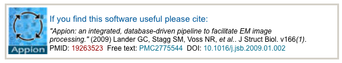

This function centers the particles in a stack based on a radial average of all the particles in the stack. This program functions iteratively, using only integer shifts to avoid interpolation artifacts. Particles that do not consistently center are removed from the stack.

## General Workflow:

1.  Check the run name and write a description for the new stack.
2.  Set the outer mask radius for centering (determined by particle or box size), and set a maximum number of pixels that any image can be shifted. If, in order to be centered, an image needs to be shifted more pixels than specified by the user, it will be eliminated from the stack.
3.  If you want to commit the new stack to the database, make sure this box is checked.
4.  Click "Center Particles" to submit to the cluster. Alternatively, click "Just Show Command" to obtain a command that can be copied and pasted in a unix shell.

## Notes, Comments, and Suggestions:

[<Filter by MeanStdev](/appion/Appion_Manual/Appion_User_Guide/Appion_Processing/Stacks/More_Stack_Tools/View_Stacks/Filter_by_MeanStdev) | [Sort Junk >](/appion/Appion_Manual/Appion_User_Guide/Appion_Processing/Stacks/More_Stack_Tools/View_Stacks/Sort_Junk)
