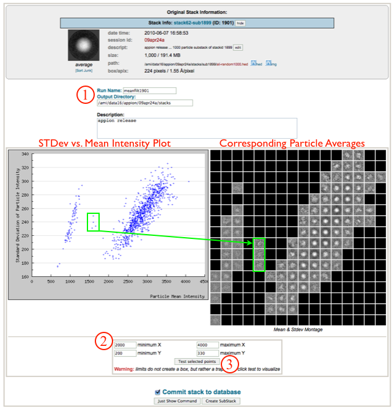
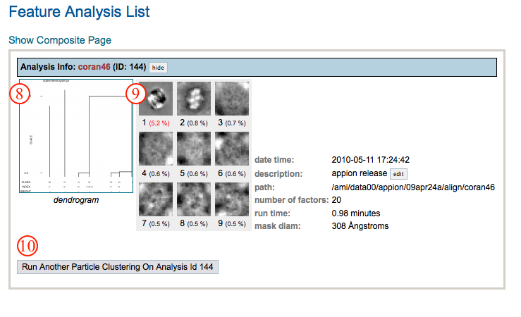

Filter particle stack by mean and stdev values.

## General Workflow:

1.  Check run name, output directory location, and write a description for this filtering run.
2.  Input min and max values for the x-axis (mean particle intensity) and the y-axis (stdev).
3.  Click "Test selected points" to refresh the graph with a trapezoid that defines the particles to keep.
    
4.  Check the resulting trapezoid and repeat steps 2-3 until satisfied.
5.  Click "Create SubStack" to submit to the cluster. Alternatively, click "Just Show Command" to obtain a command that can be copied and pasted into a unix shell.
    
6.  If your job has been submitted to the cluster, a page will appear with a link "Check status of job", which allows tracking of the job via its log-file. This link is also accessible from the "1 running" option under the "Stacks" submenu in the Appion Sidebar. When the job is finished, the tally for "X Complete" under the "Stacks" submenu in the Appion Sidebar will increase by one; the filtered stack can be accessed on the summary page by clicking on the "X complete" link.

## Notes, Comments, and Suggestions:

[<View Stacks](/appion/Appion_Manual/Appion_User_Guide/Appion_Processing/Stacks/More_Stack_Tools/View_Stacks) | [Center Particles >](/appion/Appion_Manual/Appion_User_Guide/Appion_Processing/Stacks/More_Stack_Tools/View_Stacks/Center_Particles)
