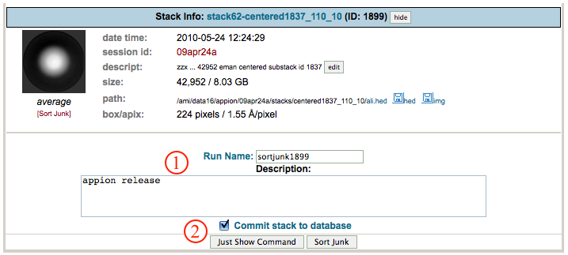
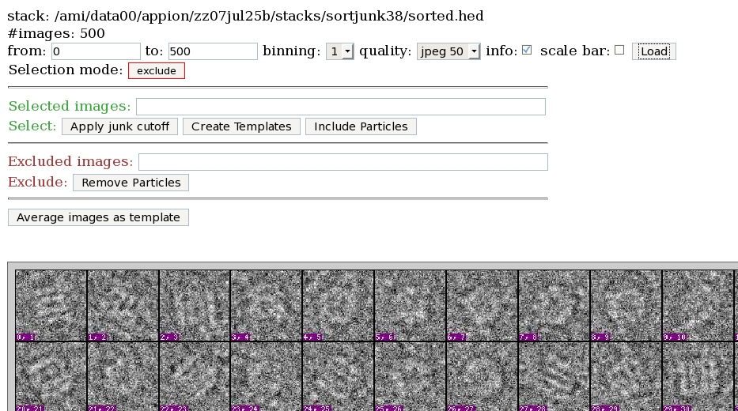

Xmipp Sort by Statistics: This function sorts the particles in a stack by how closely they resemble the average. In general, this will sort the particles by how likely that they are junk. After sorting the particles a new stack will be created, you will then have to select at which point the junk starts and Apply junk cutoff. The second function, Apply junk cutoff will then create a third stack with no junk in it.

## General Workflow:

1.  Check run name and enter a description.
2.  Make sure the "Commit to Database" box is checked if appropriate. Click "SortJunk" to submit to the cluster. Alternatively, click "Just Show Command" in order to copy and paste into a unix shell.
     
    
     
3.  After sort junk has run, return to the stack view and select [Apply Junk Cutoff] to select a cutoff point.
4.  Update the image range to show as many images as you would liek to see. The best images appear first, the images most likely to be junk appear last. Press "Load" to view the images.
5.  Under "Selection mode" press the exclude button to toggle it to "select".
6.  Click on the last image that you would liek to include in a new stack.
7.  Select "Apply junk cutoff"
    
     
8.  Enter a description in the next screen and select "Apply Junk Cutoff"

## Notes, Comments, and Suggestions:

[< Center Particles](/appion/Appion_Manual/Appion_User_Guide/Appion_Processing/Stacks/More_Stack_Tools/View_Stacks/Center_Particles) | [Create Substack >](/appion/Appion_Manual/Appion_User_Guide/Appion_Processing/Stacks/More_Stack_Tools/View_Stacks/Create_Substack)
