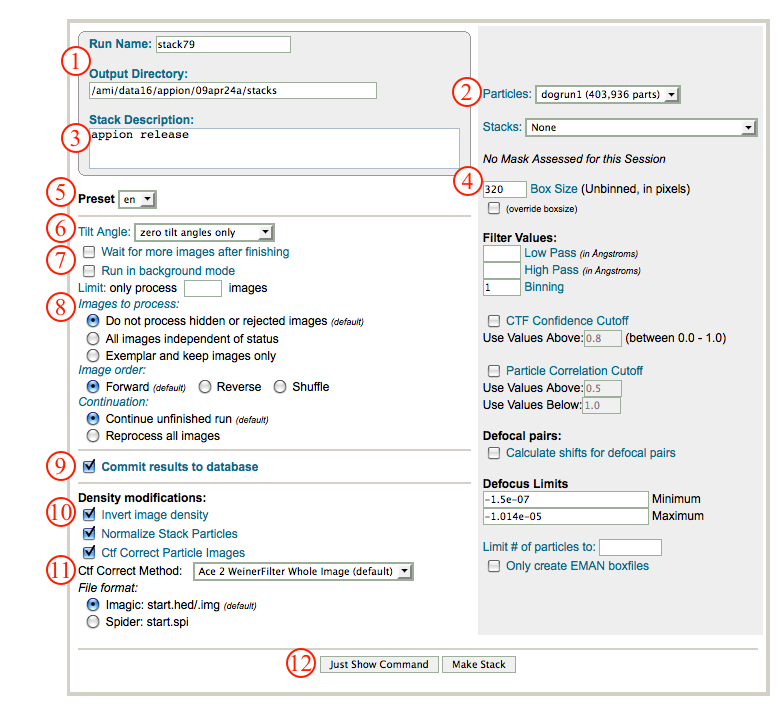
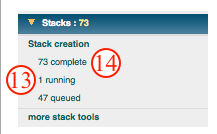
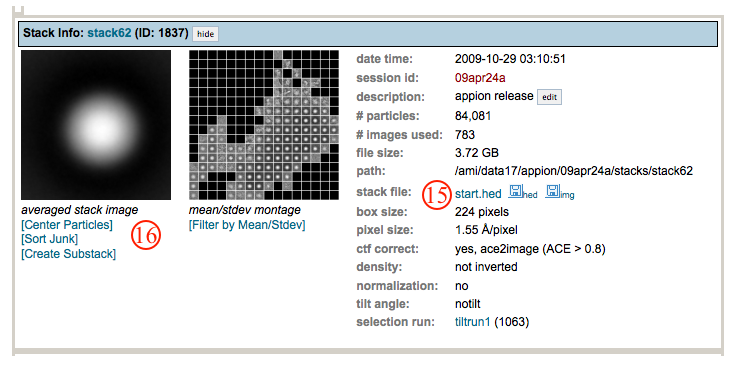
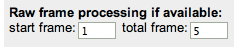

This procedure boxes out particles and is also able to apply CTF and astigmatism correction.

## General Workflow:

1.  Make sure that appropriate run names and directory trees are specified. Appion increments names automatically, but users are free to specify proprietary names and directories.
2.  Select the [particle selection](/appion/Appion_Manual/Appion_User_Guide/Appion_Processing/Particle_Selection) run to use for boxing from the drop down menu.
3.  Enter a run description.
4.  Enter a box size '''How does one determine what box size to enter?'''
5.  Select the appropriate preset of images to search (default is en if you collected with leginon).
6.  From the drop down menu, select whether you want to box particles on tilted images as well (for RCT and OTR, make two separate stacks for tilted and untilted particles!)
7.  Check these boxes if you are creating this stack concurrent with data collection, particle selection, and CTF estimation. Appion will wait for more picms to roll in.
8.  You can pre-filter particles in accordance with your rejection (hide) or exemplar decisions in the image viewer and/or using the [image assessment tool](/appion/Appion_Manual/Appion_User_Guide/Appion_Processing/Image_Assessment).
9.  Make sure that "Commit to Database" box is checked. (For test runs in which you do not wish to store results in the database this box can be unchecked).
10. Check the "invert image density" box if you collected ice data and wish to perform 2D alignment and classification. Also, if you wish to normalize your stack to STDEV of 1.0, select the "Normalize Stack Particles" box.
11. To apply CTF correction, select the "Ctf Correct Particle Images" box, and choose the CTF correction method from the drop down menu. We like the ACE2 WeinerFilter Whole Image corrector. **For phase plate data, do not apply CTF correction since none of these programs handle phase shift correctly. For template making 2D claasification purpose, just invert density is enough for these low-defocus images**
12. Click on "Make Stack" to submit your job to the cluster. Alternatively, click on "Just Show Command" to obtain a command that can be pasted into a UNIX shell.
    
13. If your job has been submitted to the cluster, a page will appear with a link "Check status of job", which allows tracking of the job via its log-file. This link is also accessible from the "1 running" option under the "Stack creation" submenu in the appion sidebar.
14. Once the job is finished, an additional link entitled "1 complete" will appear under the "Stack Creation" tab in the appion sidebar. This opens a summary of all stacks that have been created for this project.
    
15. On the stack list page, click on the "start.hed" link to browse through montages of stack particles.
16. A variety of tools are available for centering and clean-up of particle stacks. Also see [more stack tools](/appion/Appion_Manual/Appion_User_Guide/Appion_Processing/Stacks/More_Stack_Tools).
    

## Direct Detector Frame Processing Options:

If the images used to extract the particles are from frame-saving camera and the frames are saved, it is possible to create particle stack using the sum of a subset of the frames associated with the image. Just specify the start and total number of frames to be considered. Frame number counts from 0. In the following example, the frames 1,2,3,4,5 will be used where 1 is the second frame in the movie.

## Notes, Comments, and Suggestions:

1.  Default parameters work well generally.
2.  Remember that, if you low pass or high pass filter your stack particles, then any filters applied during subsequent processing will be in addition to this original filter. We tend to filter during alignment instead of during stack creation.
