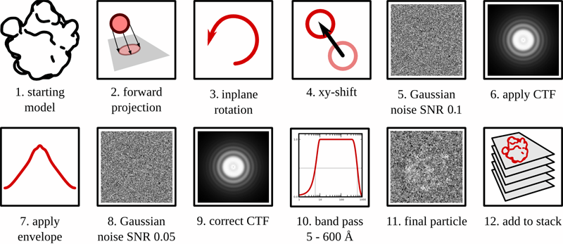
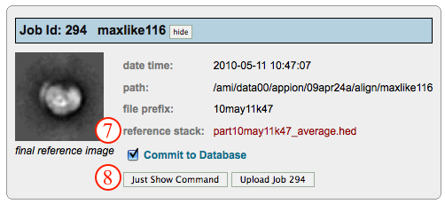

This method uses projections of a 3D model in order to create a synthetic dataset. Although it can be modified according to the options specified, the scheme consists of 12 basic steps, as shown and summarized below:

1.  a model is chosen from which projectinos are created
2.  the model is projected either in an even distribution or with axial preference
3.  the projections are randomly rotated in the XY plane
4.  the projections are randomly shifted in the XY plane
5.  white Gaussian noise is added
6.  a contrast transfer function is added according to the specified defocus parameter and the spherical aberration constant of the microscope
7.  an envelope function is added according to an experimentally determined decay function from 3000 real micrographs (see Voss, N, Lyumkis, D. et al, JSB (2010) 169, 3, 389-98).
8.  a second level of Gaussian noise is added, usually to bring the signal-to-noise ratio down to ~0.05, consistent with real ice data (see Baxter, WT, et al, JSB (2009) 166, 2, 126-32).
9.  (optional) the CTF is estimated by ACE2 and corrected
10. (optional) the particle is band-pass filtered
11. final particle of 50S ribosomal subunit with a SNR of 0.05
12. particle is added to a growing stack of synthetic particles

## General Workflow:

1.  Make sure that appropriate run names and directory trees are specified. Appion increments names automatically, but users are free to specify proprietary names and directories.
2.  Enter a description of your run into the description box.
3.  Specify whether or not you want to commit the results to the database
4.  The model selected on the previous page is shown here
5.  the model parameters are shown here. NOTE: the boxsize of the model will be the boxsize of the resulting stack.
6.  The user can specify how the projections are to be carried out. In this example, the projections are evenly distributed at an angular increment of 5 degrees (one can note that, because "evenly distributed" is selected in the pulldown, the third option is blacked out). They are then randomly shifted by 5 pixels and randomly rotated in every possible direction. Once can also specify the "axial preference" option, in which case the projections mainly revolve around the 3 axes with a specified standard deviation about the projection axis. This was initially used to test common lines routines, which usually perform better with highly variable views of the particle
7.  the two levels of signal-to-noise are specified. In test cases, it was found that more realistic looking particles are created when the 1st SNR level is 2x bigger than the second. For example, if you want the final SNR level to be 0.1, spcify 0.2 in the first box, then 0.1 in the second.
8.  a contrast transfer function is applied according to the specified defocus in the X and Y directions, as well as the angle of astigmatism. If you would like to randomize the defocus values, then the values will also be perturbed according to the standard deviation. For example, if the defocus is --1.5 (X), --1.5 (Y) and the standard deviation is 0.3, then 67% of the defoci will fall into the range of ~~1.2~~ --1.8 microns.
9.  Specify this option ONLY if you would like to correct for the applied CTF. In the example figure, the checkbox is not marked, and the options are blacked out. "Applied CTF" means that the CTF correction uses equivalent values as CTF application (essentially adding a Wiener filter to the projections). "Use ACE2 Estimate" uses the ACE2 program in order to estimate the CTF for synthetically created micrographs, which is usually quite robust unless the SNR is very low. "Perturb Applied CTF" attempts to simulate errors in CTF estimation algorithms by slightly perturbing the value of the corrected CTF compared to the applied CTF. For example, the applied CTF might be based on a defocus of - 1.5 microns, but, when this option is specified with a standard deviation of 0.05, then 67% of the corrected parameters will be off by +/- 0.05 microns or less.
10. the final stack can be optionally band-pass filtered and normalized
    
11. when the run is finished, the user is notified of its completion. NOTE: the synthetic dataset creation utility effectively creates a stack of particles. Therefore clicking either on the number completed within the "synthetic dataset creation" category OR within the stack category will take you to the same stack summary page. The former, however, will only display the synthetic stacks, while the latter will display all stacks.
    
