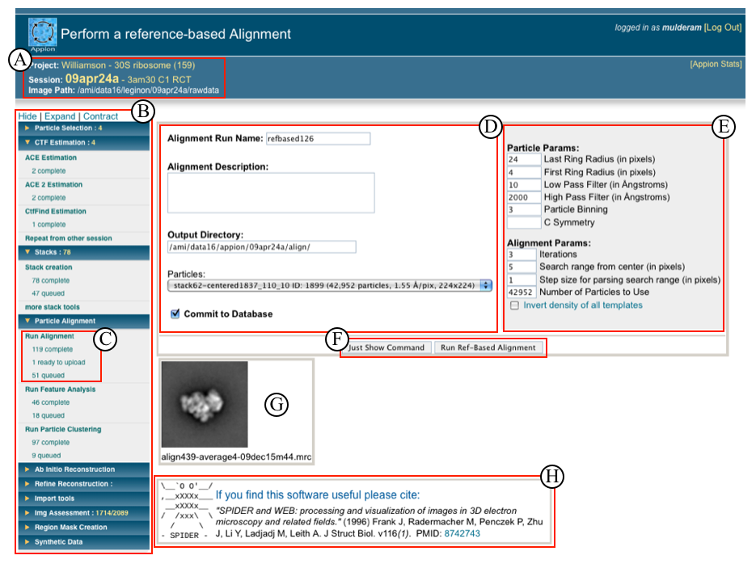

## Overview of Processing Pages:

A. Project name, EM Session name for current dataset, and directory path for images

B. Appion SideBar is where all jobs are launched and tracked. It consists of several drop-down menus, organized in accordance with image processing stage. Only the processing steps possible for a given project at a given time are displayed (i.e. if you are working with untilted data, all tilt-data processing options are hidden). The top of this menu contains options to hide, expand, or contract the side bar.

C. Submenus contain links for running a particular process, and also keeps track of the the jobs completed, queued, or running at a given time. Clicking on the link for running a particular procedure opens the options available for that procedure in a window next to the appion sidebar. If the procedure has several packages associated with it (such as alignment), an initial page opens with click able links to the Appion processing pages for the various algorithms available.

D. The left side of processing pages display the minimal parameters that a user should check before running, and provides drop down menus where appropriate.

E. The right side of processing pages is a gray box containing parameters that more experienced users are familliar with. Floating help boxes appear when mousing over a particular operation to guide the user in appropriately setting these parameters. Default parameters are automatically entered.

F. To run a procedure the user can click "Run Command" to submit the job or "Just Show Command" to copy and paste the command into a unix terminal. If the "Commit to Database" box is checked, either method will track the process in the database and display the results in the appion processing pages.

G. Underneath user defined parameter boxes appion displays any additional information relevant to the process. In this case, the template that was selected for reference based alignment is displayed.

H. References to the particular software used for any given procedure are provided. **Please let us know if we have missed or need to update a reference**!

## Appion SideBar and Processing Page Snapshot:

## Notes, Comments, and Suggestions:

[Common Workflow >](/appion/Appion_Manual/Appion_User_Guide/Appion_Processing/Common_Workflow)
