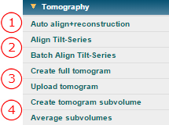

This section contains the step-by-step procedures for calculating tomograms.

## Warning: These processing are designed for Leginon acquired-tilt series only. Uploaded tilt series does not work

## General Workflow:

1.  [Auto align+reconstruction](/appion/Appion_Manual/Appion_User_Guide/Appion_Processing/Tomography/Align_tilt_series)
2.  [Align Tilt-Series (Appion-Protomo)](/appion/Appion_Manual/Appion_User_Guide/Appion_Processing/Tomography/Align_Tilt-Series)
3.  [Create & Upload Tomogram](/appion/Appion_Manual/Appion_User_Guide/Appion_Processing/Tomography/Upload_full_tomogram)
4.  [Create Tomogram Subvolume](/appion/Appion_Manual/Appion_User_Guide/Appion_Processing/Tomography/Create_tomogram_subvolume)
    -   [Average Subvolumes](/appion/Appion_Manual/Appion_User_Guide/Appion_Processing/Tomography/Create_tomogram_subvolume/Average_tomogram_subvolumes)

## Appion SideBar Snapshot:

## Notes, Comments, and Suggestions:

[< CTF Estimation](/appion/Appion_Manual/Appion_User_Guide/Appion_Processing/CTF_Estimation) | [Align Tilt Series >](/appion/Appion_Manual/Appion_User_Guide/Appion_Processing/Tomography/Align_tilt_series)
