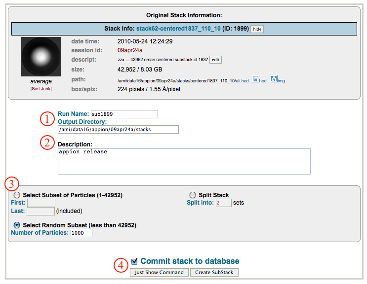
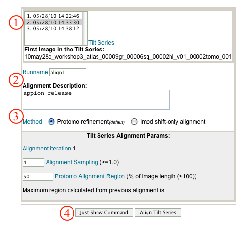
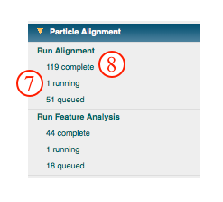
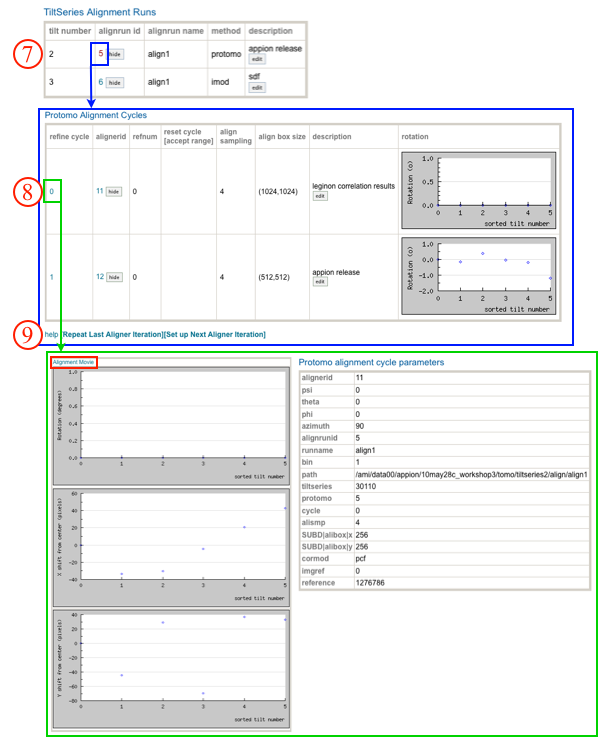

Currently, there are three working methods for automated or semi-automated alignment:

1.  using the correlation-based image alignment from Imod packages as implemented in eTomo "Rough Alignment".
2.  using iterative geometry-refinement/reconstruction method from proTomo.
3.  using the phase-correlated image alignment determined during Leginon data collection (Available as the initial alignment when using proTomo method.

## General Workflow:

1.  Select the tiltseries to align.
2.  Check the runname and enter a description.
3.  Use the radio button to select Protomo Refinement or IMOD shift-only alignment.
4.  To submit the job to the cluster click the "Align Tilt Series" button. Alternatively, click on "Just Show Command" to obtain a command that can be pasted into a UNIX shell.
    
5.  If your job has been submitted to the cluster, a page will appear with a link "Check status of job", which allows tracking of the job via its log-file. This link is also accessible from the "1 running" option under the "Aliogn tilt series" submenu in the appion sidebar.
6.  Now click on the "1 Complete" link under the "Align tilt series" submenu. This opens a summary of all tilt series alignment runs that have been completed for this dataset.
    
7.  Clicking on the "alignrun id" opens a summary page for the alignment cycles that were run.
8.  Clicking on the "refine cycle" number opens a report page for that cycle including input parameters and directory paths. Clicking on "Alignment Movie" opens a new web-browser with a movie of the aligned tilt series.
9.  The same alignment cycle can be repeated by clicking "Repeat Last Aligner Iteration" or another initiated by clicking "Setup Next Aligner Iteration" (See Step 11 below).
10. In order to [calculate a tomogram](/appion/Appion_Manual/Appion_User_Guide/Appion_Processing/Tomography/Create_full_tomogram) from the aligned tiltseries, click on the "Create full tomogram" link in the Tomography menu on the Appion Sidebar.
    
11. If you selected "Repeat Last Aligner Iteration or "Setup Next Aligner Iteration" in step 9: Enter the tilt image that protomo should use as a starting point for refinement during this next round; default is to use zero degree image. Note that once you've entered this image number, the corresponding image is surrounded by a blue circle in the tilt-series graph. If the previous refinement run was good for only a subset of the tiltseries, then under the "Reset alignment outside the range.." caption, enter a range for the sub-set of images for which the refinement was good. A box will appear in the graph above, showing the subset of images for which the previous alignment parameters will be kept; the remaining images will retain their alignment parameters for the run before last. Note that a dropdown menu is available in case the alignment parameters to apply are from a run other than the previous. Default is to include all images and to use the last iteration.
12. Enter a description of this run. For example "repetition of alignrun id 5".
13. Click "Align Tilt Series" to submit to the cluster. Alternatively, click "Just Show Command," to copy and paste the command into a unix shell.
    
14. If your job has been submitted to the cluster, a page will appear with a link "Check status of job", which allows tracking of the job via its log-file. This link is also accessible from the "1 running" option under the "Aliogn tilt series" submenu in the appion sidebar.
15. Now click on the "1 Complete" link under the "Align tilt series" submenu. This opens a summary of all tilt series alignment runs that have been completed for this dataset, including the latest refinement runs. Either proceed with more refinement as outlined in steps 9-14, or continue to [calculate a tomogram](/appion/Appion_Manual/Appion_User_Guide/Appion_Processing/Tomography/Create_full_tomogram) from the aligned tiltseries.

## Notes, Comments, and Suggestions:

For developers:
[appiondata tables involved in this process](/appion/Tomo_alignment_appiondata)

[< Tomography](/appion/Appion_Manual/Appion_User_Guide/Appion_Processing/Tomography) | [Create Full Tomogram >](/appion/Appion_Manual/Appion_User_Guide/Appion_Processing/Tomography/Create_full_tomogram)
