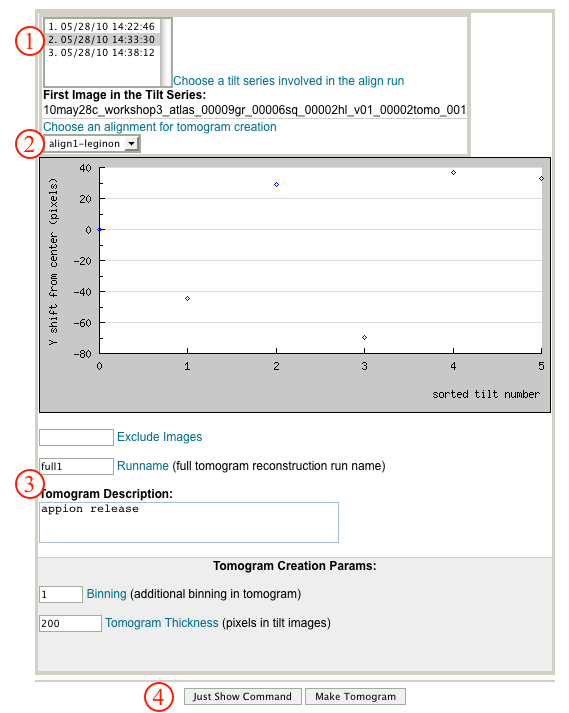
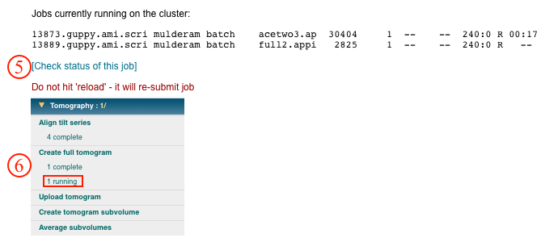

## General Workflow:

1.  Select the tiltseries for which a tomogram is to be calculated.
2.  Select the alignment run from [Align tilt series](/appion/Appion_Manual/Appion_User_Guide/Appion_Processing/Tomography/Align_tilt_series) to be used.
3.  Check the run name and enter a description.
4.  To submit the job to the cluster click the "Create Full Tomogram" button. Alternatively, click on "Just Show Command" to obtain a command that can be pasted into a UNIX shell.
    
5.  If your job has been submitted to the cluster, a page will appear with a link "Check status of job", which allows tracking of the job via its log-file. This link is also accessible from the "1 running" option under the "Create full tomogram" submenu in the appion sidebar.
6.  Now click on the "1 Complete" link under the "Create full tomogram" submenu. This opens a summary of all tomograms that have been calculated for this dataset.
    
7.  Clicking on the "id" opens a summary page for the calculated tomogram that includes input parameters and file directory paths.
8.  In order to [upload this tomogram](/appion/Appion_Manual/Appion_User_Guide/Appion_Processing/Tomography/Upload_full_tomogram) for further processing, click on the "Upload full tomogram" link in the Tomography menu on the Appion Sidebar.
    

## Notes, Comments, and Suggestions:

[< Align Tilt Series](/appion/Appion_Manual/Appion_User_Guide/Appion_Processing/Tomography/Align_tilt_series) | [Upload Tomogram >](/appion/Appion_Manual/Appion_User_Guide/Appion_Processing/Tomography/Upload_full_tomogram)
