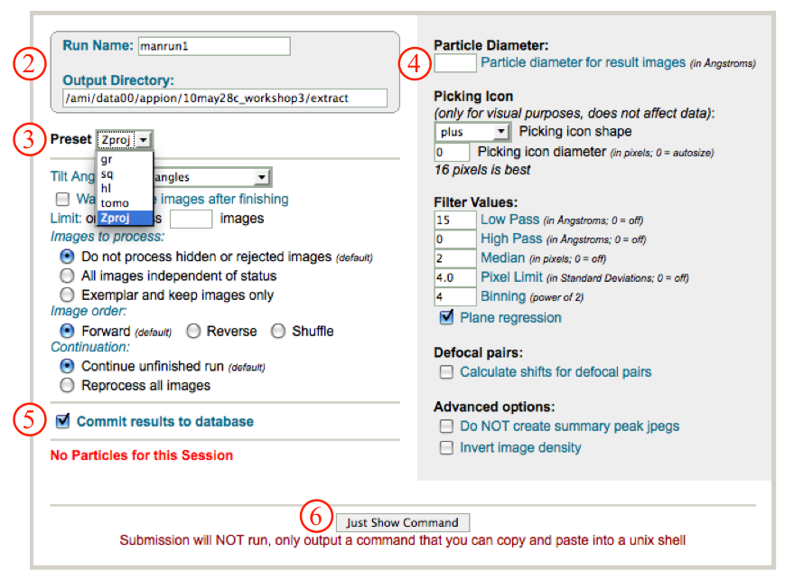
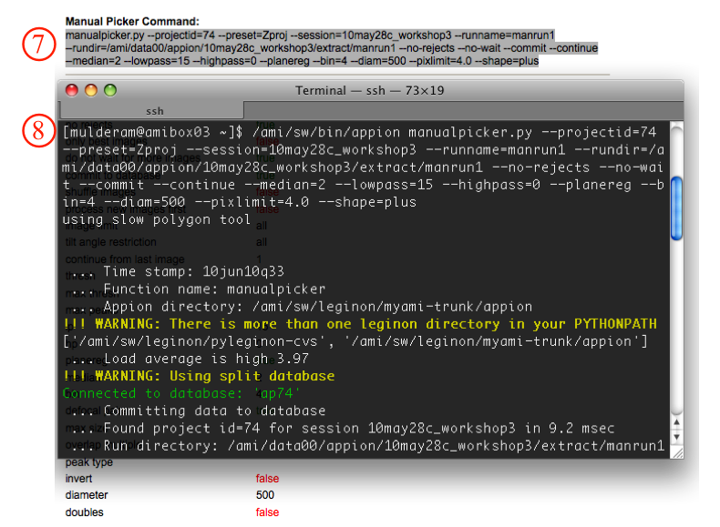
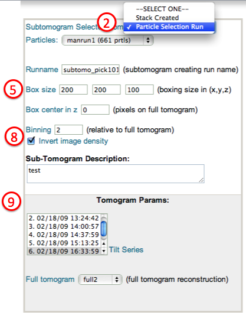

In order to extract subvolumes from a full-size tomogram, the user first needs to use the [particle selection](/appion/Appion_Manual/Appion_User_Guide/Appion_Processing/Particle_Selection) tool to pick which portions of the projected full tomogram the subvolumes are centered on. Subtomograms of uniform size can then be extracted using create subtomogram option under tomography tag.

## General Workflow:

### Select the center of the desired subtomogram as particle

You are most likely to use "manual picking" for unique object, which is what we outline here. If there are multiple copy of the particle projected to the same plan and you plan to do 3D averaging of the subtomograms, you might be able to use other [particle selection](/appion/Appion_Manual/Appion_User_Guide/Appion_Processing/Particle_Selection) methods, too.

1.  In the Appion Sidebar, select "manual picking" option under the "Particle Selection" submenu such as "manual picking".
2.  Check the run name and output directory.
3.  Select the "zproj" present from the dropdown menu. This means that you will be selecting portions of your tomogram using only these images.
4.  Set a diameter for the resulting images (won't affect actual boxing, just display).
5.  Check the commit to database box.
6.  Click the "Just Show Command" button.
    
7.  A new window will open with a command that can be copied and then:
8.  pasted into a unix terminal to run. NOTE: Manual picker cannot be run from the webpage!
    

### Extract subvolumes of the full tomogram

1.  In the Appion Sidebar, select "create tomogram subvolumes" option under the "Tomography" submenu
2.  Choose to get the subvolume center from either particle selection run or stack of particles (If the subvolumes will be averaged using appion, a substack chosen from one or more classes of aligned particle from the 2D Z-projection images must be used here.)
3.  Select from the valid runs or stacks
4.  The default run name is based on the id of the particle selection or particle stack.
5.  Choose the size of the subvolume in pixels of the tilt series images.
6.  If the subvolume is offset in Z direction, a non-zero subvolume center should be put in.
7.  Enter the binning applies to the subvolumes
8.  Invert image density if this is an cryo-tomogram since most rendering program expect the object is brighter than the background.
9.  Specify the full tomogram from which the subvolume is extracted from.
    

1.  To [average multiple tomogram subvolumes](/appion/Appion_Manual/Appion_User_Guide/Appion_Processing/Tomography/Create_tomogram_subvolume/Average_tomogram_subvolumes), click on the "Average tomogram subvolumes" link in the "Tomography" submenu on the Appion sidebar.

## Notes, Comments, and Suggestions:

[< Create Full Tomogram](/appion/Appion_Manual/Appion_User_Guide/Appion_Processing/Tomography/Create_full_tomogram) | [Average Tomogram Subvolumes >](/appion/Appion_Manual/Appion_User_Guide/Appion_Processing/Tomography/Create_tomogram_subvolume/Average_tomogram_subvolumes)
