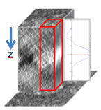

Subvolume averaging implemented here aligns the 3D subvolumes using

1.  The 2D alignment of the particles picked from the Z-projection of the full tomogram for xy plane alignment
2.  Center of mass of the central slice of each subvolume in z direction.
    
    h2. General Workflow:

1.  Particles need to be picked on the Z-projection images,
2.  A [stack made](/appion/Appion_Manual/Appion_User_Guide/Appion_Processing/Stacks) from these picked particles
3.  The stack need to be [align and classified](/appion/Appion_Manual/Appion_User_Guide/Appion_Processing/Particle_Alignment) in 2D
4.  [Select 2D Classes](/appion/Select_2D_Classes) to [create a substack](/appion/Appion_Manual/Appion_User_Guide/Appion_Processing/Stacks/More_Stack_Tools/View_Stacks/Create_Substack)
5.  [Create tomogram subvolume](/appion/Appion_Manual/Appion_User_Guide/Appion_Processing/Tomography/Create_tomogram_subvolume) using the substack so that the alignment parameters are linked.
6.  Select "Average subvolumes" in Appion sidebar under Tomography submenu.
7.  Choose the substack
8.  Enter runname (The directory where it is saved is automatically determined now)

## Notes, Comments, and Suggestions:

[< Create Tomogram Subvolumes](/appion/Appion_Manual/Appion_User_Guide/Appion_Processing/Tomography/Create_tomogram_subvolume)
