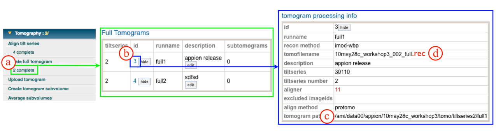
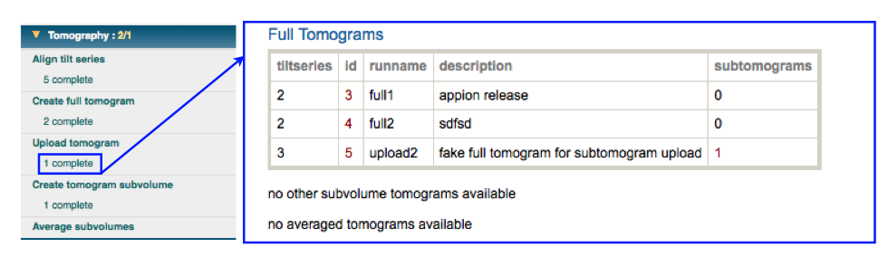
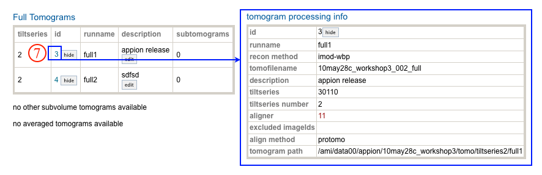

## General Workflow:

1.  Click on the"Upload tomogram" link under the Tomography submenu in the Appion Sidebar. Enter the file name and directory path for the tomogram that is to be uploaded. This information can be found in the summary page for the tomogram:
    a. Click on "X complete" under the "Create full tomogram" menu in the appion sidebar.
    b. Click on the tomogram id corresponding to the tomogram that is to be uploaded.
    c. Copy the tomogram *path* name and paste into the box for main step 1.
    d. Copy the tomogram *file* name and paste into the box for main step 1. *Add ".rec" to the end of the filename!!*
    
2.  Select the orientation of your tomogram or subvolume. Default for a full tomogram collected in Leginon is XZY: left. See the floating help box to decide what is appropriate for your tomogram.
3.  Enter a description of the tomogram to be uploaded.
4.  Select the tiltseries corresponding to the tomogram. This will automatically fill out the remainder of the form.
5.  Click "Upload Tomogram" to submit to the cluster. Alternatively, click "Just Show Command", for a command that can be copied and pasted into a unix shell.
    
6.  If your job has been submitted to the cluster, a page will appear with a link "Check status of job", which allows tracking of the job via its log-file. This link is also accessible from the "1 running" option under the "Upload Tomogram" submenu in the appion sidebar.
7.  Once the job is finished, an additional link entitled "X Complete" will appear under the "Upload Tomogram" tab in the appion sidebar. Click on this link, and a page will open with a summary of all the tomograms that have been uploaded for this session.
    
8.  Clicking on the "id" opens a summary page for the calculated tomogram that includes input parameters and file directory paths.
9.  The next step is to [create a tomogram subvolume](/appion/Appion_Manual/Appion_User_Guide/Appion_Processing/Tomography/Create_tomogram_subvolume).
    

## Notes, Comments, and Suggestions:

[< Create Full Tomogram](/appion/Appion_Manual/Appion_User_Guide/Appion_Processing/Tomography/Create_full_tomogram) | [Create Tomogram Subvolume >](/appion/Appion_Manual/Appion_User_Guide/Appion_Processing/Tomography/Create_tomogram_subvolume)
