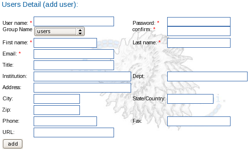
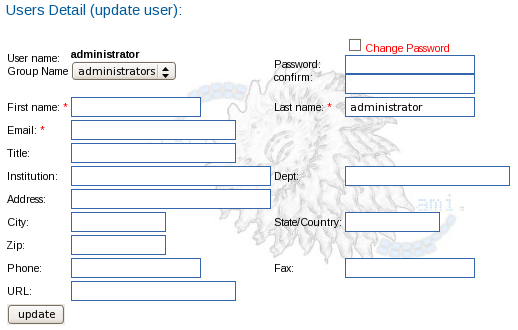

From the Administration tool, an administrator may:

-   View all Users
-   Add a User
-   Modify a User's profile

**Note:** Currently, users may not be removed from the database.

The following tasks may be completed with the [Project tool](/appion/Appion_Manual/Appion_User_Guide/Appion_and_Leginon_Database_Tools/Project_DB):

-   [Share a Project session with a User](/appion/Appion_Manual/Appion_User_Guide/Appion_and_Leginon_Database_Tools/Project_DB/Share_a_Project_Session_with_another_User)
-   [Make a User a Project Owner](/appion/Appion_Manual/Appion_User_Guide/Appion_and_Leginon_Database_Tools/Project_DB/Edit_Project_Owners)

## Default users

Username Firstname Lastname Displayed Group Description
---------------------- --------------------------------------------- ------------------------ ----------------------------------------------------------------------------------------------------------------------------------------
administrator Leginon-Appion Administrator administrators Default leginon settings are saved under this user
anonymous Public User guests If you want to allow public viewing to a project or an experiment, assign it to this user

## View all Users

Users may be viewed and managed within the Administration tool.

1.  Open a web browser. Go to 'http://yourhost/myamiweb/admin.php'.
2.  Click on the Users icon:
    

A list of the registered users is displayed with the following information:

-   Last name
-   First name
-   Email
-   Username
-   Institution
-   Phone

You may sort the users by clicking on the column headers.

## Add a User

1.  Open a web browser. Go to 'http://yourhost/myamiweb/admin.php'.
2.  Click on Users.
3.  Click on Add A New User (Only administrators can do this if the login feature is activated)
4.  Add a "username" (required) for the user. (This is like a one-word username that people use to log into a computer).
5.  Enter all required information.
6.  Add this user to a previously created group. Or, create a new group for this user. (required)
7.  Click on the Add button to add the new user to the database.

## Modify a User's profile

1.  Open a web browser. Go to 'http://yourhost/myamiweb/admin.php'.
2.  Click on Users.
3.  Click on the edit icon (pencil) next to the user you wish to modify.
4.  Modify the desired fields.
5.  To change the password, you must check the box located above the password field.
6.  Click on the Update button to save your changes.

[< Groups](/appion/Appion_Manual/Appion_User_Guide/Appion_and_Leginon_Database_Tools/Administration/Groups) | [Revert Settings >](/appion/Appion_Manual/Appion_User_Guide/Appion_and_Leginon_Database_Tools/Administration/Revert_Settings)
