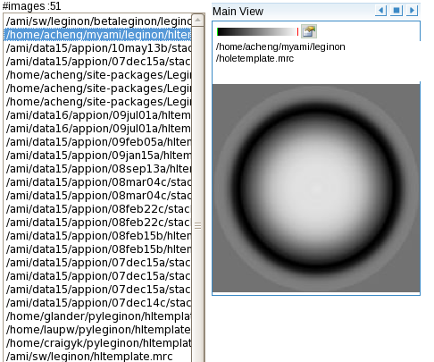

The Hole Template Viewer tool allows Leginon users to view the templates used to find grid holes.

[< Tomography Tool](/appion/Appion_Manual/Appion_User_Guide/Appion_and_Leginon_Database_Tools/Tomography_Tool)
